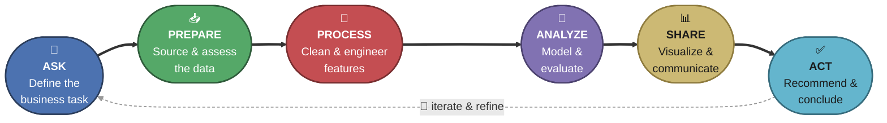
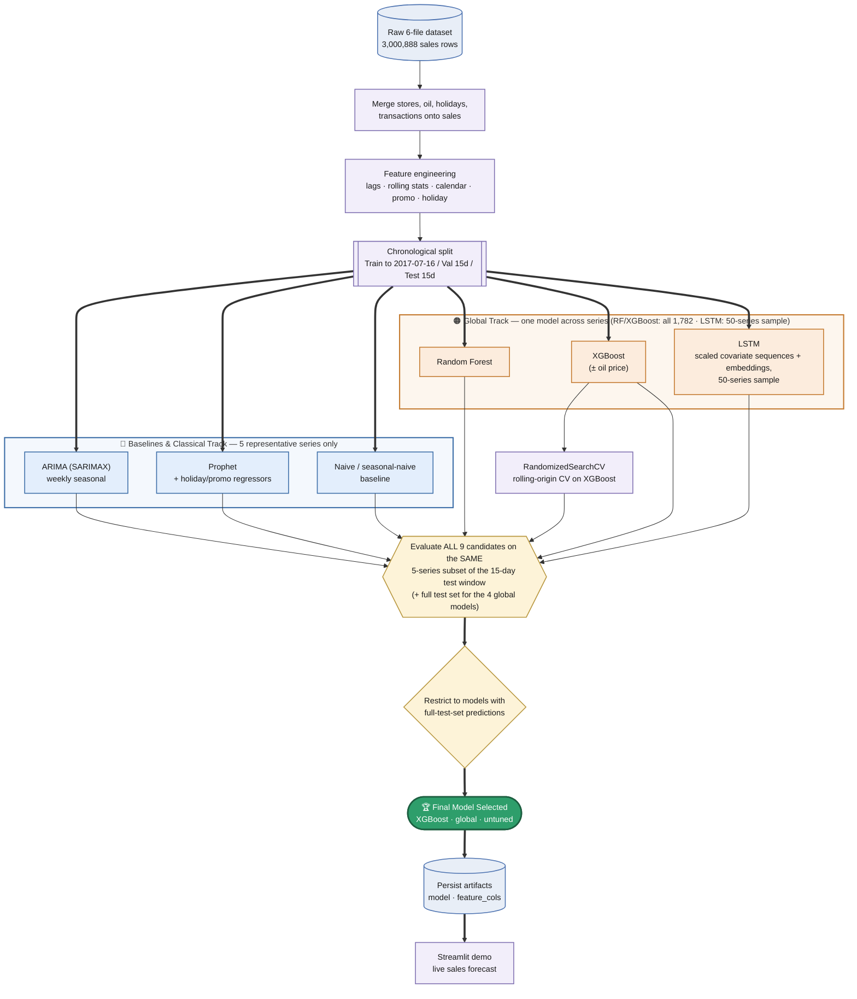
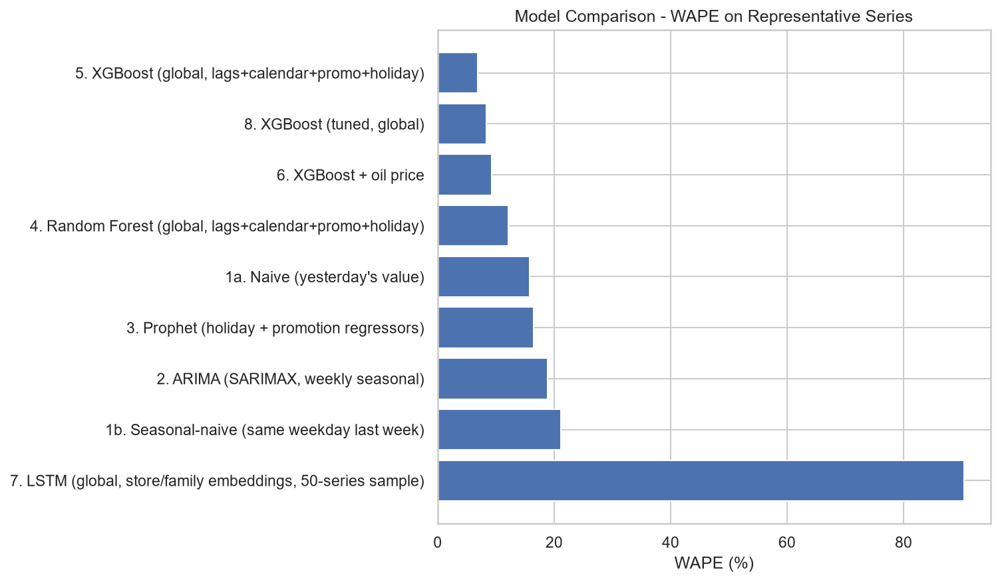

# 📦 Retail Demand Forecasting

**Data Science Internship Project — Codec Technologies**


A demand-forecasting pipeline built on [Store Sales — Time Series Forecasting](https://www.kaggle.com/competitions/store-sales-time-series-forecasting), a ~3-million-row multi-series retail dataset from Corporación Favorita, a 54-store Ecuadorian grocery chain. Nine modeling experiments — naive baselines, per-series classical models (ARIMA, Prophet), global machine-learning models across all 1,782 series, and an LSTM benchmark on 50 series — are compared on a held-out 15-day window, with deployable models selected by validation WAPE.

**Headline result**: the final model forecasts daily unit sales **one day ahead** across all 1,782 store × family series over a 15-day held-out window with a **WAPE of 12.93%** and **RMSE of 198.28**. The naive baseline (yesterday's value), scored on the same full test set, reaches a WAPE of **23.30%**, and the model beats it on RMSE for **28 of 33 product families (84.8%)** — both Ask-phase success criteria are met.

---

## Table of Contents

- [About the Project](#about-the-project)
- [Internship & Course Background](#internship--course-background)
- [The Six-Phase Analysis Framework](#the-six-phase-analysis-framework)
- [Project Roadmap & Timeline](#project-roadmap--timeline)
- [Machine Learning Workflow](#machine-learning-workflow)
- [Modeling Techniques, Tools & Metrics](#modeling-techniques-tools--metrics)
- [Tools & Tech Stack by Phase](#tools--tech-stack-by-phase)
- [Visualization Reference](#visualization-reference)
- [Repository Structure](#repository-structure)
- [Setup](#setup)
- [Usage](#usage)
- [Results at a Glance](#results-at-a-glance)
- [Key Findings](#key-findings)
- [Limitations](#limitations)
- [Dataset & Citation](#dataset--citation)
- [Streamlit Deployment](#streamlit-deployment)
- [Author](#author)

---

## About the Project

> ### Retail Demand Forecasting
> **Goal:** Forecast product demand to optimize inventory, using historical sales data, promotions, and holidays as inputs.
>
> **Guidelines:**
> - Use ARIMA, Prophet, or LSTM for time-series prediction
> - Evaluate with RMSE or MAPE

That is the original brief for this internship project. Everything else in this repository — the 9-experiment comparison matrix spanning classical, global-ML and deep-learning tracks, the leakage-safe lag/rolling feature engineering, the fair WAPE-optimized final-model selection among deployable global models, and the interactive demo — is this brief carried out end-to-end on a real ~3-million-row, 1,782-series dataset, following the same six-phase analysis cycle used in the internship's [Fraud Detection System](../fraud-detection-system) project and its foundational coursework (see below).

| | |
|---|---|
| **Task** | Multi-series regression — forecast daily unit sales per store × product-family combination, one day ahead, evaluated over a 15-day held-out window |
| **Dataset** | Store Sales (Corporación Favorita), 3,000,888 training rows, 1,782 store × family series across 54 stores and 33 product families |
| **Approach** | 9-experiment comparison matrix (naive, ARIMA, Prophet, Random Forest, XGBoost ×2, tuned XGBoost, LSTM) + fair WAPE-optimized selection among deployable global models |
| **Final model** | XGBoost (global, untuned) — `n_estimators=400, max_depth=8, learning_rate=0.05` |
| **Result** | RMSE = 198.28 · **WAPE = 12.93%** · Bias = +2.98% (full test set, 26,730 rows) |
| **Full write-up** | [`retail_demand_forecasting_report.md`](./retail_demand_forecasting_report.md) |

---

## Internship & Course Background

This project is a **capstone-style follow-on** to the 8-week Data Science internship at **Codec Technologies**, reusing the same six-phase workflow and toolchain established in the internship's [Fraud Detection System](../fraud-detection-system) project.

### Internship Curriculum

| Week | Focus | Ties to This Project |
|---|---|---|
| 1 | Introduction to Data Science | Framed the business task and reused the six-phase analysis cycle from the fraud project |
| 2 | Data Cleaning and Preprocessing | Oil-price interpolation, transferred-holiday resolution, series-completeness checks |
| 3 | Exploratory Data Science (EDA) | Sales distribution, seasonality, promotion/holiday effects, correlation snapshot (Section 7 of the report) |
| 4 | Advanced Data Science | Lag/rolling feature engineering computed per series, chronological train/val/test methodology |
| 5 | Machine Learning Basics | Naive/seasonal-naive baselines, ARIMA, Prophet |
| 6 | Applied Machine Learning | Global Random Forest & XGBoost experiment matrix, rolling-origin hyperparameter tuning |
| 7 | Big Data and Cloud Computing | Handling a 3M-row, 1,782-series dataset efficiently (dtype optimization, per-series groupby feature engineering) |
| 8 | **Final Project** | **This repository** — end-to-end multi-series demand-forecasting system |

### Foundational Coursework: Google Data Analytics Professional Certificate

| Week | Course | Core Content | Applied in This Project |
|---|---|---|---|
| 1 | Foundations: Data, Data, Everywhere | The 6-phase analysis process, analytical thinking, the data ecosystem | Structures the whole project end-to-end |
| 1 | Ask Questions to Make Data-Driven Decisions | SMART questions, problem framing, "prediction" as a problem archetype | Ask phase — business task & success criteria |
| 2 | Prepare Data for Exploration | The ROCCC data-quality framework, sampling/observer/confirmation bias, data ethics | Dataset ROCCC assessment, sales-vs-demand caveat |
| 3 | Process Data from Dirty to Clean | Data integrity, the "dirty data" taxonomy, cleaning workflows | Oil-price interpolation, transferred-holiday logic, leakage-safe lag features |
| 4 | Analyze Data to Answer Questions | Aggregation, GROUP BY-style analysis, pattern-finding, joins | EDA, sales-by-family/city/cluster breakdowns, the 9-experiment comparison matrix |
| 5 | Share Data Through the Art of Visualization | Chart selection, dashboarding, storytelling with data | Model-comparison bar chart, actual-vs-predicted plots, feature-importance plot, the Streamlit demo |
| 6 | Data Analysis with R Programming | Tidyverse/dplyr, ggplot2, R Markdown, reproducibility | Reproducible environment practices (`requirements.txt`, notebook) — implemented in **Python** rather than R |
| 7 | Google Data Analytics Capstone | End-to-end case study structure, portfolio packaging | This report's problem → data → methods → results → recommendations |

The certificate teaches this six-phase workflow using spreadsheets, SQL, Tableau, and R.
**This project implements the same six-phase cycle end-to-end in Python** — pandas/NumPy in place of spreadsheets, statsmodels/Prophet/scikit-learn/XGBoost/TensorFlow in place of a BI tool, and Jupyter/GitHub in place of Tableau dashboards.

---

## The Six-Phase Analysis Framework

Every phase of this project maps directly onto the cycle used throughout the Google Data Analytics Certificate and the fraud-detection project before it:



| Phase | What It Means Here | Primary Output |
|---|---|---|
| **Ask** | Define the demand-forecasting business task and SMART success criteria (WAPE ≤ 15%, RMSE below naive baseline for ≥80% of families) | Problem statement (Report) |
| **Prepare** | Download the 6-file Kaggle dataset, assess it against ROCCC, document schema, series completeness, and the sales-vs-demand distinction | Dataset overview (Report) |
| **Process** | Oil-price interpolation, transferred-holiday resolution, per-series lag/rolling feature engineering, chronological train/val/test split | Modeling-ready feature set (Report) |
| **Analyze** | Run the 9-experiment matrix (naive → classical → global ML → deep learning), tune the strongest global candidate, select fairly among deployable models | Results table + selected model (Report) |
| **Share** | Model-comparison bar chart, actual-vs-predicted plots, correlation heatmap, feature-importance plot, optional Streamlit demo | 18 result visualizations (`assets/`) |
| **Act** | Recommend inventory adjustments by forecast bias, document limitations, package as a portfolio-ready GitHub repository | Recommendations & next steps (Report) |

---

## Project Roadmap & Timeline

### Suggested Timeline (from the project plan)

| Week | Phase(s) | Planned Focus |
|---|---|---|
| Week 1 | Ask + Prepare | Problem framing, dataset download/assessment, environment setup, initial EDA across all 6 files |
| Week 2 | Process | Date/holiday/promotion cleaning, oil-price interpolation, lag/rolling/calendar feature engineering, chronological split |
| Week 3 | Analyze | Naive baseline, ARIMA and Prophet on representative series, first global tree-based models |
| Week 4 | Analyze (cont.) | LSTM track, hyperparameter tuning via rolling-origin cross-validation, final model selection |
| Week 5 | Share | Visualizations, optional Streamlit demo, written report and GitHub packaging |
| Week 6 | Act + Presentation | Recommendations, limitations, internship presentation/demo, polish |

### Actual Execution Roadmap

In practice, the classical (ARIMA/Prophet) and global-ML tracks were developed together in a single notebook, and the report/README went through a reconciliation pass once the real results came in — including the finding that hyperparameter tuning did not actually improve on the untuned model. Each stage below is color-coded to match its phase in the six-phase framework:

```mermaid
%%{init: {"flowchart": {"curve": "basis"}, "themeVariables": {"fontSize": "14px"}}}%%
flowchart TD
    subgraph W1["🎯📥&nbsp; WEEK 1 &nbsp;·&nbsp; Ask + Prepare"]
        direction TB
        A1(["Define business task<br/>& SMART criteria"])
        A2(["Set up venv, Git<br/>& Kaggle access"])
        A3(["Download 6-file dataset<br/>~3M rows, 1,782 series"])
        A4(["Dataset overview &<br/>series-completeness checks"])
        A1 --> A2 --> A3 --> A4
    end

    subgraph W2["🧹&nbsp; WEEK 2 &nbsp;·&nbsp; Process"]
        direction TB
        B1(["Resolve transferred-<br/>holiday flag"])
        B2(["Interpolate oil-price<br/>gaps (31.1% missing)"])
        B3(["Engineer per-series lag,<br/>rolling & calendar features"])
        B4(["Chronological split<br/>— never a random shuffle"])
        B1 --> B2 --> B3 --> B4
    end

    subgraph W34["🔬&nbsp; WEEKS 3–4 &nbsp;·&nbsp; Analyze"]
        direction TB
        C1(["Naive & seasonal-naive<br/>baseline"])
        C2(["Classical track<br/>ARIMA + Prophet, 5 series"])
        C3(["Global ML track: Random Forest<br/>& XGBoost (± oil)"])
        C4(["LSTM benchmark<br/>scaled covariate sequences + embeddings"])
        C5(["Rolling-origin tuning +<br/>fair final selection"])
        C1 --> C2 --> C3 --> C4 --> C5
    end

    subgraph W5["📊&nbsp; WEEK 5 &nbsp;·&nbsp; Share"]
        direction TB
        D1(["Model-comparison bar chart<br/>& actual-vs-predicted plots"])
        D2(["Feature-importance<br/>plot"])
        D3(["Streamlit demo"])
        D4(["Written report<br/>+ README"])
        D1 --> D2 --> D3 --> D4
    end

    subgraph W6["✅&nbsp; WEEK 6 &nbsp;·&nbsp; Act"]
        direction TB
        E1(["Recommendations<br/>& limitations"])
        E2(["Reconciliation pass:<br/>numbers, artifacts, .gitignore"])
        E3(["Final polish &<br/>GitHub packaging"])
        E1 --> E2 --> E3
    end

    W1 ==> W2
    W2 ==> W34
    W34 ==> W5
    W5 ==> W6

    classDef askprepare fill:#4C72B0,color:#ffffff,stroke:#2c3e5c,stroke-width:1.5px,rx:8,ry:8
    classDef process    fill:#C44E52,color:#ffffff,stroke:#7a2f31,stroke-width:1.5px,rx:8,ry:8
    classDef analyze    fill:#8172B2,color:#ffffff,stroke:#4d4370,stroke-width:1.5px,rx:8,ry:8
    classDef share      fill:#CCB974,color:#1a1a1a,stroke:#8f7c3f,stroke-width:1.5px,rx:8,ry:8
    classDef act        fill:#64B5CD,color:#1a1a1a,stroke:#376c7d,stroke-width:1.5px,rx:8,ry:8

    class A1,A2,A3,A4 askprepare
    class B1,B2,B3,B4 process
    class C1,C2,C3,C4,C5 analyze
    class D1,D2,D3,D4 share
    class E1,E2,E3 act

    style W1  fill:#eef2fa,stroke:#4C72B0,stroke-width:2px, color:#000000
    style W2  fill:#fceeee,stroke:#C44E52,stroke-width:2px, color:#000000
    style W34 fill:#f2eef8,stroke:#8172B2,stroke-width:2px, color:#000000
    style W5  fill:#fbf8ea,stroke:#CCB974,stroke-width:2px, color:#000000
    style W6  fill:#eaf5f9,stroke:#64B5CD,stroke-width:2px, color:#000000
```



---

## Machine Learning Workflow

The modeling pipeline itself — the heart of the Analyze phase — follows a leakage-aware, chronologically-split comparison workflow across three model tracks. Node shapes carry meaning throughout: **cylinders** are data at rest, **diamonds** are decisions/branch points, and the **pill-shaped node** is the final outcome.



**Key design choices baked into this workflow:**
- The split is **chronological, never a random shuffle** — training only ever sees dates before validation/test, which is what makes lag/rolling features and the reported metrics trustworthy for a real forecasting deployment.
- ARIMA and Prophet satisfy the guideline's named classical techniques directly, fit on the **top 5 highest-volume series**; the global tree-based models cover all ~1,782 series, while the LSTM is a time-validated 50-series benchmark kept within internship scope.
- The final model is chosen from **only the deployable models with full-series predictions** — the representative-series-only classical/deep-learning experiments are compared for context but aren't candidates for the final artifact, since there's no global model behind them to save. Those deployable candidates are ranked by validation WAPE before the separate test evaluation.

---

## Modeling Techniques, Tools & Metrics

### Experiment Matrix

| # | Model | Category | Scope | Library |
|---|---|---|---|---|
| 1a/1b | Naive / Seasonal-naive | Baseline heuristic | 5 representative series | — |
| 2 | ARIMA (SARIMAX) | Classical statistical | 5 representative series | `statsmodels` |
| 3 | Prophet | Additive decomposition + holiday/promo regressors | 5 representative series | `prophet` |
| 4 | Random Forest | Global machine learning (bagged trees) | All 1,782 series | `scikit-learn` |
| 5 | XGBoost | Global machine learning (boosted trees) | All 1,782 series | `xgboost` |
| 6 | XGBoost + oil price | Global machine learning | All 1,782 series | `xgboost` |
| 7 | LSTM | Deep learning, scaled covariate sequences + store/family embeddings | 50-series sample | `tensorflow` / `keras` |
| 8 | XGBoost (tuned) | Global machine learning + `RandomizedSearchCV` | All 1,782 series | `xgboost` + `scikit-learn` |

### Evaluation Metrics

| Metric | What It Measures | Why It Matters Here |
|---|---|---|
| **RMSE** | √(mean squared error) | Named in the guidelines; targets the mean, sensitive to large promotion-day spikes |
| **MAPE** | Mean absolute percentage error | Named in the guidelines, but unreliable here: zero-sales days are excluded from the calculation, and low-volume series with small nonzero actuals inflate it |
| **WAPE** ⭐ | Weighted absolute percentage error (Σ\|error\| / Σ\|actual\|) | Primary guideline-adjacent metric — aggregates cleanly across all 1,782 series into one interpretable number, without MAPE's zero-division problem |
| **Forecast Bias** | (Σpredicted − Σactual) / Σactual | Directly answers "are we systematically over- or under-stocking?" — the business-facing tie-breaker |

MAPE is reported for every experiment (per the guideline) but was **not** used to pick the winner — Section 13 of the report explains why it's misleading on this dataset's many zero-sales and low-volume series.

### Model Explainability

| Tool | Role |
|---|---|
| `.feature_importances_` (XGBoost) | Bar chart of which lag/calendar/exogenous features drive the winning model's forecasts |

---

## Tools & Tech Stack by Phase

| Phase | Tasks | Tools / Libraries |
|---|---|---|
| **Ask** | Problem framing, SMART success criteria | Markdown documentation (no code) |
| **Prepare** | Dataset download, schema/ROCCC assessment, dataset-overview functions | `pandas`, `numpy`, `kaggle` CLI |
| **Process** | Oil-price interpolation, holiday resolution, per-series lag/rolling/calendar feature engineering, chronological split | `pandas`, `numpy` |
| **Analyze** | Naive + classical + global ML + deep-learning tracks, hyperparameter tuning | `statsmodels`, `prophet`, `scikit-learn`, `xgboost`, `tensorflow`/`keras` |
| **Share** | Visualization, explainability, interactive demo | `matplotlib`, `seaborn`, `plotly`, `streamlit` |
| **Act** | Artifact persistence, reporting, packaging | `joblib`, Markdown, Git/GitHub |

### Full Tech Stack

| Category | Tools |
|---|---|
| **Language** | Python 3.11 |
| **Environment** | `venv` + `pip`, VS Code (Python + Jupyter extensions) |
| **Data handling** | `pandas`, `numpy` |
| **Visualization** | `matplotlib`, `seaborn`, `plotly` |
| **Classical time series** | `statsmodels` (SARIMAX), `prophet` |
| **Machine learning** | `scikit-learn`, `xgboost` |
| **Deep learning** | `tensorflow` / `keras` (LSTM with embeddings) |
| **Deployment demo** | `streamlit` |
| **Data source** | `kaggle` CLI + API token |
| **Persistence** | `joblib` |
| **Version control** | Git + GitHub |

The pinned project environment is in [`requirements.txt`](./requirements.txt), generated from the working environment with `pip freeze`.

---

## Visualization Reference

All 18 figures live in [`assets/`](./assets) and are generated directly by the notebook (each plotting cell saves to `assets/` before displaying inline).

| # | File | Plot Type | What It Shows |
|---|---|---|---|
| 01 | `01_total_sales_over_time.png` | Line chart | Total daily unit sales across all stores and families, 2013–2017 |
| 02 | `02_sales_distribution.png` | Histogram (log-scaled x-axis) | Distribution of nonzero daily sales |
| 03 | `03_sales_by_family.png` | Horizontal bar chart | Total sales by product family, top 15 |
| 04 | `04_sales_by_store_type.png` | Bar chart | Total sales by store type (A–E) |
| 05 | `05_oil_price_over_time.png` | Line chart | WTI oil price over time (gaps interpolated for plotting) |
| 06 | `06_promotion_effect.png` | Bar chart | Average sales, on promotion vs. not |
| 07 | `07_holiday_counts.png` | Bar chart | Holiday/event rows by type |
| 08 | `08_dayofweek_seasonality.png` | Line/bar chart | Average sales by day of week |
| 09 | `09_monthly_seasonality.png` | Line chart | Average sales by month |
| 10 | `10_sales_by_city.png` | Horizontal bar chart | Total sales by city, top 10 |
| 11 | `11_sales_by_cluster.png` | Bar chart | Total sales by store cluster |
| 12 | `12_holiday_effect.png` | Bar chart | Average sales, holiday/event date vs. regular day |
| 13 | `13_transactions_vs_sales_scatter.png` | Scatter plot (sampled) | Daily transactions vs. daily sales, per store |
| 14 | `14_raw_correlation_heatmap.png` | Heatmap | Correlation among raw daily aggregates, before feature engineering |
| 15 | `15_missing_days_distribution.png` | Histogram | Distribution of missing calendar days per store × family series |
| 16 | `16_model_comparison_bar.png` | Horizontal bar chart | WAPE across all experiments on the representative-series comparison |
| 17 | `17_actual_vs_predicted.png` | Line chart | Actual vs. predicted sales for a representative series over the test window |
| 18 | `18_feature_importance.png` | Horizontal bar chart | Top 15 features by importance for the final XGBoost model |

**Why these plot types:** line charts for anything sequential (total sales, oil price, monthly seasonality, actual-vs-predicted), bar/horizontal-bar charts for categorical comparisons (family, city, cluster, store type, model comparison), histograms for distributional questions (sales, missing days), a scatter plot for the two-variable transactions/sales relationship, a heatmap for many-variable correlation at a glance, and the feature-importance bar chart as the most stakeholder-friendly way to explain *what* drives the final model's forecasts.

---

## Repository Structure

```
retail-demand-forecasting/
├── retail-demand-forecasting.ipynb     # Full analysis: EDA → features → modeling → evaluation
├── exports/                            # Rendered exports of the notebook (HTML/PDF) — viewable without Jupyter
├── retail_demand_forecasting_report.md # In-depth written report (problem → data → methods → results → recs)
├── README.md                           # You are here
├── streamlit_app.py                    # Interactive demo — live sales forecast
├── requirements.txt                    # Pinned project environment (pip freeze)
├── .kaggle/                            # Kaggle API token — gitignored
├── .gitignore
├── .streamlit/                         # Streamlit config (config.toml)
├── assets/                             # 18 result figures used by the report/README (tracked)
├── data/                               # Store Sales CSVs — gitignored
└── models/                             # Saved model artifacts — generated by the notebook, tracked in Git (the deployed demo loads them)
```

## Setup

1. **Create and activate a virtual environment**
   ```bash
   python -m venv .venv
   # Windows
   .\.venv\Scripts\Activate.ps1
   # macOS/Linux
   source .venv/bin/activate
   ```

2. **Install dependencies**
   ```bash
   pip install -r requirements.txt
   ```

3. **Get the dataset** — download the Store Sales dataset via the Kaggle competition CLI (requires a `kaggle.json` API token in `~/.kaggle/`, or set the `KAGGLE_CONFIG_DIR` environment variable to this repo's `.kaggle/` folder):
   ```bash
   kaggle competitions download -c store-sales-time-series-forecasting
   ```
   Unzip the 6 CSVs (`train.csv`, `test.csv`, `stores.csv`, `oil.csv`, `holidays_events.csv`, `transactions.csv`) into `data/`.

## Usage

**Run the full analysis**
Open `retail-demand-forecasting.ipynb`, update `DATA_DIR` if your folder differs, and run all cells. This performs EDA, engineers leakage-safe lag/rolling/calendar features, runs all 9 experiments plus tuning, and saves the winning model to `models/`. Every plot is written to `assets/` automatically as it's generated.

Prefer not to install Jupyter first? Open the rendered export in `exports/` in any browser to see the fully executed notebook, outputs and all.

**Try the interactive demo**
Once the notebook has run at least once (so `models/final_model.joblib` exists):
```bash
streamlit run streamlit_app.py
```
Pick a product family, store type, and cluster, enter recent sales history and promotion/holiday details, and get a live 1-day-ahead demand forecast. The demo needs no local copy of `data/` to run — store type/cluster are entered directly rather than looked up from `stores.csv` — and lag/rolling-window features are likewise entered directly rather than looked up live; see the report's Limitations section.

## Results at a Glance

**Representative-series comparison — all 9 experiments scored on the same 5 series (75 test rows).** ARIMA and Prophet forecast the whole window from a single origin (multi-step); the other models use actuals through the previous day (one-step), so the classical rows are not like-for-like with the rest.

| Experiment | RMSE | MAPE | WAPE | Bias |
|---|---|---|---|---|
| 1a. Naive (yesterday's value) | 2,063.52 | 16.22% | 15.77% | +1.93% |
| 1b. Seasonal-naive (same weekday last week) | 2,503.25 | 21.75% | 21.14% | +8.66% |
| 2. ARIMA (SARIMAX, weekly seasonal) | 2,348.80 | 19.40% | 18.83% | +12.71% |
| 3. Prophet (holiday + promo regressors) | 2,031.17 | 17.07% | 16.49% | +9.56% |
| 4. Random Forest (global) | 1,596.41 | 12.32% | 12.26% | +9.31% |
| **5. XGBoost (global, untuned)** ⭐ | **857.10** | **7.05%** | **6.86%** | +2.24% |
| 6. XGBoost + oil price | 1,301.33 | 9.70% | 9.77% | +5.65% |
| 7. LSTM (50-series sample, scored on the 5 series) | 1,518.11 | 11.87% | 12.31% | +4.94% |
| 8. XGBoost (tuned, global) | 1,120.32 | 8.76% | 8.62% | +3.77% |

> **Experiment 7 (LSTM) is a valid sampled benchmark, not a deployable candidate.** It uses 28-day sequences of training-only scaled sales and promotions, calendar/holiday inputs, store/family embeddings, Huber loss, and explicit chronological validation. It scores RMSE **1,518.11**, MAPE **11.87%**, WAPE **12.31%**, and bias **+4.94%** on the 5 series; its full 50-series reference result is RMSE **502.52**, MAPE **31.69%**, WAPE **12.91%**, and bias **+3.47%**. It outperforms naive, ARIMA, and Prophet on the representative-series comparison, but is not eligible for final-model selection because it was not evaluated across all 1,782 series.

**Full test set — deployable global models** (26,730 rows)

The deployable candidates were selected before this evaluation using validation WAPE; untuned XGBoost ranked first at **11.56%** (versus 11.78% for Random Forest, 11.80% with oil, and 11.84% for tuned XGBoost).

| Experiment | RMSE | WAPE | Bias |
|---|---|---|---|
| **5. XGBoost (global, untuned)** ⭐ | 198.28 | **12.93%** | +2.98% |
| 8. XGBoost (tuned, global) | 214.75 | 14.25% | +4.31% |
| 6. XGBoost + oil price | 223.05 | 14.34% | +5.27% |
| 4. Random Forest (global) | 238.52 | 15.31% | +5.09% |

The tuned and oil-price variants are close on full-test WAPE (14.25% vs. 14.34%); both clearly trail the untuned, no-oil model. The untuned XGBoost also has the lowest WAPE in the 5-series table and validation ranking, so it leads all three comparisons.

**Success-criteria check (full test set)**

| Criterion | Result |
|---|---|
| Company-wide WAPE ≤ 15% | **PASS** — 12.93% |
| Naive (yesterday's value) WAPE on the same full test set | 23.30% (selected model: 12.93%) |
| Families where model RMSE < naive RMSE (target ≥ 80%) | **PASS** — 28 of 33 (84.8%) |

The families where the model does not beat naive on RMSE are SCHOOL AND OFFICE SUPPLIES, GROCERY II, BABY CARE, HOME APPLIANCES and BOOKS — the five families where the naive forecast still has the lower RMSE.

<p align="center">
  
</p>

## Key Findings

- **Every one of the 1,782 store × family series has four missing 25-Dec dates.** The feature pipeline restores these known closure dates with zero sales and promotions before creating calendar lags and rolling windows.
- **31.1% of the full date range is missing an oil price** — interpolated/forward-filled before use, since Ecuador's oil-dependent economy makes this a meaningful (if weak, at the series level) exogenous signal.
- **Global tree-based models scored far better than the per-series classical models.** On the same 5 series, untuned global XGBoost reaches WAPE 6.86% (RMSE 857) versus 18.83% for ARIMA, 16.49% for Prophet and 15.77% for the naive baseline; on the full test set it improves on naive's WAPE (12.93% vs. 23.30%). The likely driver is that their lag/rolling features use recent actuals through the previous day, which ARIMA/Prophet's single-origin multi-step forecasts do not — so the classical rows are not like-for-like.
- **Hyperparameter tuning did not improve the final model.** Tuned XGBoost scores WAPE 14.25% vs. 12.93% untuned on the full test set (8.62% vs. 6.86% on the 5 series). The date-based CV search selected `n_estimators=300`, `max_depth=6`, `learning_rate=0.05`, `subsample=0.9`, and `colsample_bytree=0.7`; RMSE-vs-WAPE objective mismatch is one possible reason it did not generalize better.
- **Oil price as a feature hurt XGBoost's WAPE** (14.34% vs. 12.93% without it on the full test set; 9.77% vs. 6.86% on the 5 series) — consistent with oil being a weak, indirect signal at the individual store × family level.
- **The corrected LSTM is a credible sampled benchmark.** On the five representative series it reaches WAPE 12.31% with +4.94% bias, outperforming naive, ARIMA, and Prophet. It remains outside final-model selection because its 50-series scope is not comparable with the all-series deployable models.

## Limitations

Sales here are realized sales, not true demand (stockouts can under-report demand); forecasts are one-day-ahead (lag/rolling features use actuals through the previous day), not 15-day-ahead, and ARIMA/Prophet forecast multi-step from one origin, so they aren't like-for-like with the other models; deployable global candidates are selected by validation WAPE and the separate 15-day test window is reserved for final evaluation; only National-level holidays were applied uniformly, leaving out Regional/Local holidays; ARIMA, Prophet, and the LSTM were validated only on a sample of series (5 and 50, respectively) rather than the full 1,782, so the sampled models are not candidates for the final artifact; and the dataset ends in 2017 and reflects Ecuador-specific seasonality and an oil-dependent economy. Full discussion, including why MAPE is reported but not used to select the winner, is in the report.

## Dataset & Citation

Corporación Favorita. "Store Sales - Time Series Forecasting." *Kaggle*, 2021. Available on [Kaggle](https://www.kaggle.com/competitions/store-sales-time-series-forecasting).

## Streamlit Deployment

[](https://internship-retail-demand-forecasting.streamlit.app/)

## Author

**Sudharshan Moodley**

[](https://www.linkedin.com/in/sudharshan-moodley-0a1a5b2a9/)
[](https://github.com/Sudharshan205-Proj)
