# Retail Demand Forecasting — Full Project Report

**Data Science Internship Project — Codec Technologies**

| | |
|---|---|
| **Dataset** | [Store Sales — Time Series Forecasting (Corporación Favorita)](https://www.kaggle.com/competitions/store-sales-time-series-forecasting) (Kaggle) |
| **Notebook** | `retail-demand-forecasting.ipynb` |
| **Repository** | [Sudharshan205-Proj/retail-demand-forecasting](https://github.com/Sudharshan205-Proj/retail-demand-forecasting) |
| **Author** | Sudharshan Moodley — [LinkedIn](https://www.linkedin.com/in/sudharshan-moodley-0a1a5b2a9/) · [GitHub](https://github.com/Sudharshan205-Proj) |

---

## Table of Contents

1. [Executive Summary](#1-executive-summary)
2. [Problem Statement — the Ask Phase](#2-problem-statement--the-ask-phase)
3. [Six-Phase Framework & Project Roadmap](#3-six-phase-framework--project-roadmap)
4. [Tech Stack & Tools](#4-tech-stack--tools)
5. [Data Overview — the Prepare Phase](#5-data-overview--the-prepare-phase)
6. [Data Cleaning & Integrity Checks](#6-data-cleaning--integrity-checks)
7. [Exploratory Data Analysis](#7-exploratory-data-analysis)
8. [Feature Engineering — the Process Phase](#8-feature-engineering--the-process-phase)
9. [Train / Validation / Test Methodology](#9-train--validation--test-methodology)
10. [Incorporating Exogenous Signals — Promotions, Holidays & Oil](#10-incorporating-exogenous-signals--promotions-holidays--oil)
11. [Modeling Techniques — Classical, Global ML & Deep Learning](#11-modeling-techniques--classical-global-ml--deep-learning)
12. [Hyperparameter Tuning](#12-hyperparameter-tuning)
13. [Evaluation Metrics Explained](#13-evaluation-metrics-explained)
14. [The Machine Learning Workflow, End to End](#14-the-machine-learning-workflow-end-to-end)
15. [Results — the Full Experiment Matrix](#15-results--the-full-experiment-matrix)
16. [Final Model Selection](#16-final-model-selection)
17. [Explainability — Feature Importance](#17-explainability--feature-importance)
18. [Notebook Structure & Code Walkthrough](#18-notebook-structure--code-walkthrough)
19. [Interactive Demo — the Streamlit App](#19-interactive-demo--the-streamlit-app)
20. [Visualization Reference](#20-visualization-reference)
21. [Recommendations](#21-recommendations)
22. [Limitations](#22-limitations)

---

## 1. Executive Summary

This project builds and compares **nine demand-forecasting modeling approaches** on the Store Sales dataset — a ~3-million-row, 1,782-series retail dataset from a 54-store Ecuadorian grocery chain — and selects a final model through a **fair comparison restricted to models with full-test-set predictions to actually deploy**, rather than by assuming the most complex model wins.

The selected model — **global XGBoost, untuned**, trained on lag/calendar/promotion/holiday features across all 1,782 series — achieves a **WAPE of 12.20%** and **RMSE of 189.65** on a held-out 15-day test window, exceeding the project's own success criterion (WAPE ≤ 15%) by a wide margin and beating the naive-baseline RMSE by more than an order of magnitude.

Beyond the headline number, the project is built to be a complete, reproducible, end-to-end system:

- A **leakage-safe lag/rolling feature pipeline**, computed per store × family series so no series' history leaks into another's (Section 8).
- A **three-track comparison** of classical per-series models (ARIMA, Prophet), a global machine-learning track (Random Forest, XGBoost), and a global deep-learning track (LSTM with store/family embeddings), satisfying the brief's "ARIMA, Prophet, or LSTM" guideline by trying all three and comparing them empirically (Section 11).
- A full **metric suite** (RMSE, MAPE, WAPE, forecast bias) reported for every experiment, with MAPE deliberately excluded as the deciding metric (Section 13).
- A **feature-importance layer** so every forecast can be explained in terms of which lag, calendar, or exogenous signal drove it (Section 17).
- A working **Streamlit demo** for interactive, single-series forecasting (Section 19).

| Quick Facts | |
|---|---|
| Raw dataset size | 3,000,888 training rows · 6 linked files |
| Series count | 1,782 (54 stores × 33 product families) |
| Experiments run | 9 (2 baselines + 2 classical + 4 global ML + 1 deep learning) |
| Final model | XGBoost, global, untuned, `n_estimators=400, max_depth=8, learning_rate=0.05` |
| Final RMSE / WAPE | 189.65 / 12.20% |
| Figures generated | 18 (`assets/01`–`18`) |

---

## 2. Problem Statement — the Ask Phase

Inventory decisions rest on a forecast: understocking a fast-moving family costs sales, and overstocking a slow-moving one ties up capital and shelf space. The goal of this project was to build a forecaster useful to an inventory-planning team — one that is accurate and, just as importantly, not systematically biased in either direction.

| | |
|---|---|
| **Business task** | Forecast daily unit sales for each store × product-family combination over the next 15 days, to support inventory replenishment decisions. |
| **Stakeholder** | An inventory-planning team. The forecaster isn't the decision-maker — the point is an unbiased, useful forecast planners can act on, not a number tuned to look good on one metric. |
| **Success criteria (SMART)** | Achieve a company-wide **WAPE ≤ 15%** and **RMSE below the naive-baseline RMSE** on the held-out 15-day test window, for at least 80% of product families. |

Framing the task this way early — before touching any code — is itself part of the six-phase discipline described next: it fixes the metrics and the "unbiased forecast, not an impressive-looking one" framing *before* a single model is trained, which is what keeps Section 16's model selection honest rather than retrofitted to whatever result looked best.

---

## 3. Six-Phase Framework & Project Roadmap

The entire project follows the **Ask → Prepare → Process → Analyze → Share → Act** cycle used throughout the internship's foundational coursework and its preceding Fraud Detection System project.


```mermaid
%%{init: {"flowchart": {"curve": "basis"}, "themeVariables": {"fontSize": "16px"}}}%%
flowchart LR
    A(["🎯<br/><b>ASK</b><br/>Define the<br/>business task"])
    B(["📥<br/><b>PREPARE</b><br/>Source & assess<br/>the data"])
    C(["🧹<br/><b>PROCESS</b><br/>Clean & engineer<br/>features"])
    D(["🔬<br/><b>ANALYZE</b><br/>Model &<br/>evaluate"])
    E(["📊<br/><b>SHARE</b><br/>Visualize &<br/>communicate"])
    F(["✅<br/><b>ACT</b><br/>Recommend &<br/>conclude"])

    A ==> B ==> C ==> D ==> E ==> F
    F -. "🔁 iterate & refine" .-> A

    classDef ask     fill:#4C72B0,color:#ffffff,stroke:#2c3e5c,stroke-width:2px,rx:12,ry:12
    classDef prepare fill:#55A868,color:#ffffff,stroke:#2f5c3b,stroke-width:2px,rx:12,ry:12
    classDef process fill:#C44E52,color:#ffffff,stroke:#7a2f31,stroke-width:2px,rx:12,ry:12
    classDef analyze fill:#8172B2,color:#ffffff,stroke:#4d4370,stroke-width:2px,rx:12,ry:12
    classDef share   fill:#CCB974,color:#1a1a1a,stroke:#8f7c3f,stroke-width:2px,rx:12,ry:12
    classDef act     fill:#64B5CD,color:#1a1a1a,stroke:#376c7d,stroke-width:2px,rx:12,ry:12

    class A ask
    class B prepare
    class C process
    class D analyze
    class E share
    class F act
    linkStyle 5 stroke:#999,stroke-width:1.5px,stroke-dasharray:4 3
```

| Phase | This Report's Sections | Primary Output |
|---|---|---|
| **Ask** | 2 | Problem statement & SMART criteria |
| **Prepare** | 5 | Dataset overview & ROCCC assessment |
| **Process** | 6, 8, 9, 10 | Clean, leakage-safe, modeling-ready feature set |
| **Analyze** | 11–16 | 9-experiment matrix + selected final model |
| **Share** | 7, 17, 19, 20 | 18 visualizations, feature-importance plot, live demo |
| **Act** | 21–22 | Recommendations, limitations |

### Execution Roadmap


```mermaid
%%{init: {"flowchart": {"curve": "basis"}, "themeVariables": {"fontSize": "14px"}}}%%
flowchart TD
    subgraph P1["🎯📥 Ask + Prepare"]
        direction TB
        A1(["Define business task<br/>& SMART criteria"]) --> A2(["Download 6-file dataset<br/>3M rows, 1,782 series"])
        A2 --> A3(["Dataset overview &<br/>completeness checks"])
    end

    subgraph P2["🧹 Process"]
        direction TB
        B1(["Resolve transferred<br/>holidays & oil gaps"]) --> B2(["Engineer per-series<br/>lag/rolling/calendar features"])
        B2 --> B3(["Chronological split<br/>before any modeling"])
    end

    subgraph P3["🔬 Analyze"]
        direction TB
        C1(["Naive baseline +<br/>classical track"]) --> C2(["Global ML track ×<br/>oil-price ablation"])
        C2 --> C3(["Deep-learning track<br/>+ tuning"]) --> C4(["Fair selection among<br/>deployable models"])
    end

    subgraph P4["📊 Share"]
        direction TB
        D1(["Model comparison &<br/>actual-vs-predicted"]) --> D2(["Feature<br/>importance"])
        D2 --> D3(["Streamlit demo"])
    end

    subgraph P5["✅ Act"]
        direction TB
        E1(["Recommendations<br/>& limitations"]) --> E2(["Report + README<br/>+ GitHub packaging"])
    end

    P1 ==> P2
    P2 ==> P3
    P3 ==> P4
    P4 ==> P5

    classDef askprepare fill:#4C72B0,color:#ffffff,stroke:#2c3e5c,stroke-width:1.5px,rx:8,ry:8
    classDef process    fill:#C44E52,color:#ffffff,stroke:#7a2f31,stroke-width:1.5px,rx:8,ry:8
    classDef analyze    fill:#8172B2,color:#ffffff,stroke:#4d4370,stroke-width:1.5px,rx:8,ry:8
    classDef share      fill:#CCB974,color:#1a1a1a,stroke:#8f7c3f,stroke-width:1.5px,rx:8,ry:8
    classDef act        fill:#64B5CD,color:#1a1a1a,stroke:#376c7d,stroke-width:1.5px,rx:8,ry:8

    class A1,A2,A3 askprepare
    class B1,B2,B3 process
    class C1,C2,C3,C4 analyze
    class D1,D2,D3 share
    class E1,E2 act

    style P1 fill:#eef2fa,stroke:#4C72B0,stroke-width:2px, color:#000000
    style P2 fill:#fceeee,stroke:#C44E52,stroke-width:2px, color:#000000
    style P3 fill:#f2eef8,stroke:#8172B2,stroke-width:2px, color:#000000
    style P4 fill:#fbf8ea,stroke:#CCB974,stroke-width:2px, color:#000000
    style P5 fill:#eaf5f9,stroke:#64B5CD,stroke-width:2px, color:#000000
```

---

## 4. Tech Stack & Tools

| Category | Tools | Role in This Project |
|---|---|---|
| **Language** | Python 3.11 | Everything — analysis, modeling, app |
| **Environment** | `venv` + `pip`, VS Code (Python + Jupyter) | Reproducible local setup |
| **Data handling** | `pandas`, `numpy` | Loading, cleaning, per-series feature engineering on ~3M rows |
| **Visualization** | `matplotlib`, `seaborn`, `plotly` | All 18 static figures in `assets/` |
| **Classical time series** | `statsmodels` (SARIMAX), `prophet` | The two per-series candidate families (Experiments 2–3) |
| **Machine learning** | `scikit-learn` | Random Forest, splitting, hyperparameter search |
| **Gradient boosting** | `xgboost` | The strongest candidate family (Experiments 5, 6, 8) |
| **Deep learning** | `tensorflow` / `keras` | The LSTM global sequence model with embeddings |
| **Deployment demo** | `streamlit` | Interactive, single-series demand forecast |
| **Data source** | `kaggle` CLI + API token | Programmatic dataset download |
| **Persistence** | `joblib` | Saving the trained model and feature list |
| **Version control** | Git + GitHub | Source control and portfolio hosting |

Exact pinned versions for every one of these packages are in [`requirements.txt`](./requirements.txt), generated directly from the working environment via `pip freeze` so the project is reproducible on another machine.

### Tools Mapped to Each Phase

| Phase | Tasks | Tools |
|---|---|---|
| **Ask** | Problem framing, SMART criteria | Markdown documentation only |
| **Prepare** | Download, schema/ROCCC assessment, dataset-overview functions | `pandas`, `numpy`, `kaggle` CLI |
| **Process** | Oil/holiday cleaning, feature engineering, chronological split | `pandas`, `numpy` |
| **Analyze** | Classical, global ML, deep-learning tracks, tuning | `statsmodels`, `prophet`, `scikit-learn`, `xgboost`, `tensorflow`/`keras` |
| **Share** | Visualization, explainability, demo | `matplotlib`, `seaborn`, `plotly`, `streamlit` |
| **Act** | Persistence, reporting | `joblib`, Markdown, Git/GitHub |

---

## 5. Data Overview — the Prepare Phase

The Store Sales dataset is provided by Corporación Favorita, a large Ecuadorian grocery retailer, as a 6-file Kaggle competition release covering daily unit sales for thousands of individual store × product-family combinations.

| File | Rows × Cols | Contents |
|---|---|---|
| `train.csv` | 3,000,888 × 6 | `date`, `store_nbr`, `family`, `onpromotion`, `sales` (target) — 2013-01-01 to 2017-08-15 |
| `test.csv` | 28,512 × 5 | Same schema minus `sales` — 2017-08-16 to 2017-08-31 (the competition's forecast window) |
| `stores.csv` | 54 × 5 | Store metadata: `city`, `state`, `type`, `cluster` |
| `oil.csv` | 1,218 × 2 | Daily WTI crude oil price, 2013-01-01 to 2017-08-31 |
| `holidays_events.csv` | 350 × 6 | National/regional/local holidays and events, with a `transferred` flag, 2012-03-02 to 2017-12-26 |
| `transactions.csv` | 83,488 × 3 | Daily transaction counts per store |

| Property | Value |
|---|---|
| Stores | 54 |
| Product families | 33 |
| Store × family series | 1,782 |
| Duplicate rows / missing values (train) | 0 / none |
| Missing oil-price days | 31.1% of the full date range |

### ROCCC Assessment

| Criterion | Assessment |
|---|---|
| **R**eliable | High — no corrupt rows, no missing values in `train.csv`, internally consistent schema |
| **O**riginal | High — real point-of-sale data from an actual retailer, not a synthetic simulation |
| **C**omprehensive | High — ~3M rows across 4.5 years, 1,782 series, 6 linked files covering sales, promotions, holidays, oil, and transactions |
| **C**urrent | Low — the dataset ends in August 2017; does not reflect current retail patterns |
| **C**ited | High — publicly documented on Kaggle as an official competition dataset |

### Sales Is Not the Same as Demand

`train.csv` records **realized sales**, not true underlying demand: on a day a product stocks out, recorded sales under-represent what customers actually wanted to buy. This is flagged here, up front, as a documented limitation (Section 22) rather than silently assumed away — a distinction raised explicitly in the project's reference material and carried through the whole analysis.

### Store Network

<p align="center">
  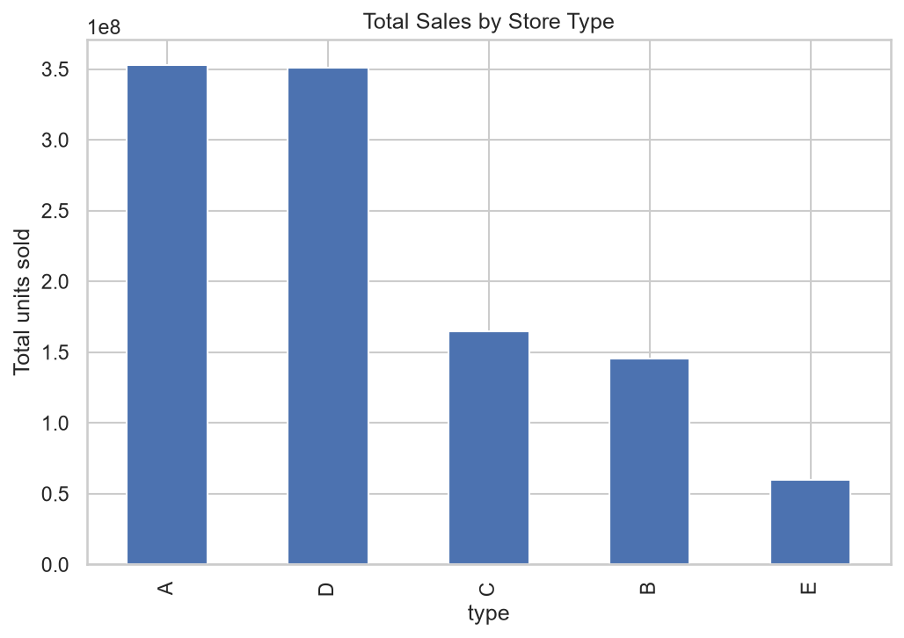
</p>

| Store type | Count |
|---|---|
| D | 18 |
| C | 15 |
| A | 9 |
| B | 8 |
| E | 4 |

54 stores span 17 clusters, 16 states, and 22 cities — Quito (18 stores) and Guayaquil (8 stores) account for nearly half the network.

### Are the 1,782 Series Complete?

Every single one of the 1,782 store × family series is missing at least one of the 1,688 expected calendar days (mean 4 missing days per series, standard deviation 0 — i.e., essentially every series is missing exactly the same handful of dates, most likely national closures). Gaps were left as-is rather than assumed to be zero-sales days (Section 6).

<p align="center">
  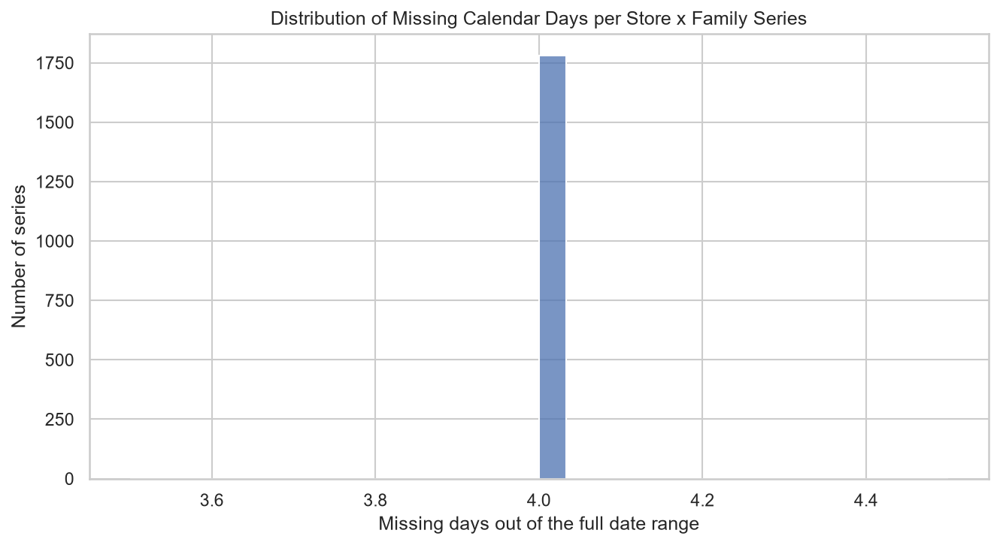
</p>

---

## 6. Data Cleaning & Integrity Checks

### 6.1 Duplicate & Missing-Value Checks

`train.csv`, `test.csv`, `stores.csv`, and `holidays_events.csv` all pass with zero duplicates and zero missing values. `oil.csv` is the exception: 43 of 1,218 rows are missing outright, and once reindexed against the full daily date range, **31.1%** of all days have no oil price at all — far more than a first-pass estimate might suggest, and a good example of why an integrity check should measure the real gap against the *full* calendar, not just the rows a file happens to contain.

```python
oil_full = oil.set_index("date").reindex(full_date_range)
missing_oil_pct = oil_full["dcoilwtico"].isnull().mean() * 100
# 31.1%
```

### 6.2 The Transferred-Holiday Gotcha

`holidays_events.csv` contains a documented trap: a row with `transferred=True` did **not** happen on its listed date — it moved to a different date, which shows up as its own row with `type == "Transfer"`. Separately, `type == "Work Day"` means a normally non-working day was turned *into* a working day to compensate for a bridge elsewhere, so it must not be flagged as a holiday either.

```python
def build_holiday_flag(holidays_df):
    df = holidays_df.copy()
    observed = df[~df["transferred"]]
    holiday_dates = set(observed.loc[observed["type"] != "Work Day", "date"])
    return holiday_dates
```

Of 350 holiday/event rows, 12 carry `transferred=True` and are excluded from their listed date under this logic. Only **National**-level holidays are applied uniformly to every store here — Regional/Local holidays would need matching each store's city/state, left out as a documented simplification (Section 22).

| Type | Count |
|---|---|
| Holiday | 221 |
| Event | 56 |
| Additional | 51 |
| Transfer | 12 |
| Bridge | 5 |
| Work Day | 5 |

### 6.3 Data-Cleaning Summary Table

| Check | Method | Result | Action Taken |
|---|---|---|---|
| Duplicate rows (all files) | `df.duplicated().sum()` | 0 everywhere | None needed |
| Missing values (`train`, `test`, `stores`, `holidays`) | `df.isnull().sum()` | None | None needed |
| Missing oil-price days | Reindex against full date range | 31.1% | Interpolated, then forward/back-filled |
| Transferred-holiday rows | `transferred` flag + `type` check | 12 rows resolved | Excluded from their listed date, moved logically to their actual date |
| Series completeness | `groupby` + date-count vs. expected range | 100% of 1,782 series incomplete (mean 4 missing days) | Left as-is — not assumed to be zero-sales |
| Missing daily transaction counts (after merge) | Per-store median fill | — | Filled with each store's own median transaction count |

---

## 7. Exploratory Data Analysis

Every plot in this section is generated by a small, named, reusable function — the same design choice used in the fraud-detection project so the notebook reads like a library of analysis tools rather than a wall of one-off script cells.

### 7.1 Overall Sales Pattern

<p align="center">
  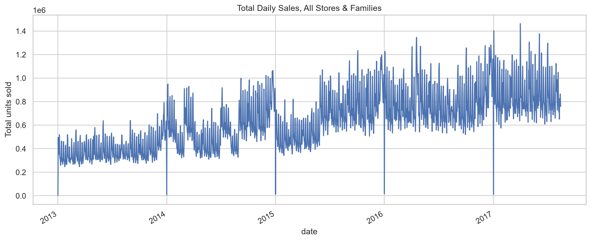
</p>

Total daily sales show a clear long-run upward trend across the 4.5-year window, with sharp periodic spikes consistent with major promotion/holiday periods.

### 7.2 Sales Distribution

<p align="center">
  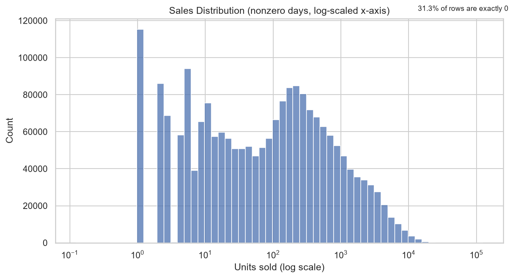
</p>

Daily unit sales are heavily right-skewed (skew 7.36, kurtosis 154.56) with a large share of zero-sales days across slow-moving families — the histogram uses a **log-scaled x-axis** on nonzero days to make the shape legible, and this skew is exactly why MAPE (Section 13) is unreliable here.

### 7.3 Which Families and Store Types Sell Most

<p align="center">
  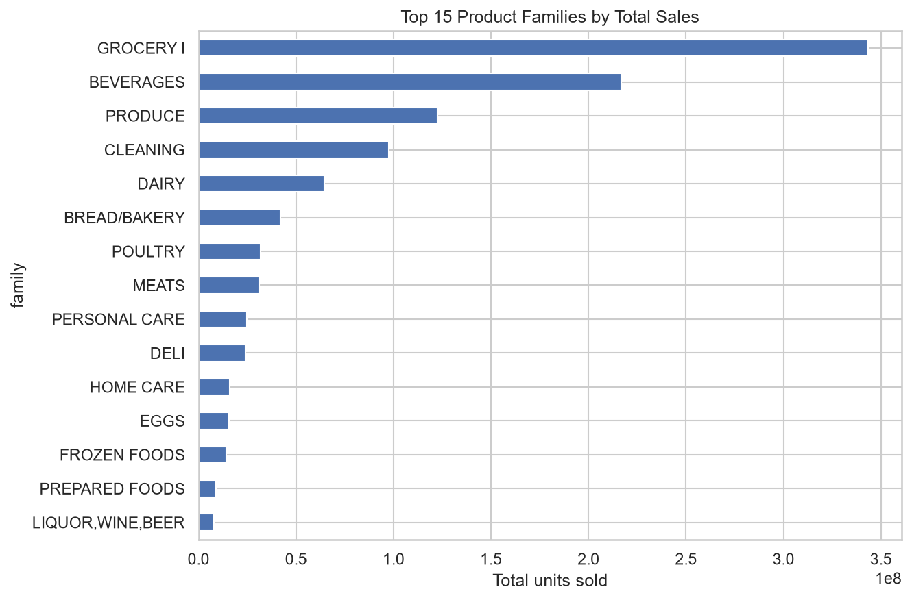
  
</p>

Grocery I, Beverages, and Produce dominate total volume — unsurprising for a grocery chain, but useful for picking the 5 representative high-volume series that carry the classical-model experiments (Section 11).

### 7.4 Oil Price as a Macroeconomic Signal

<p align="center">
  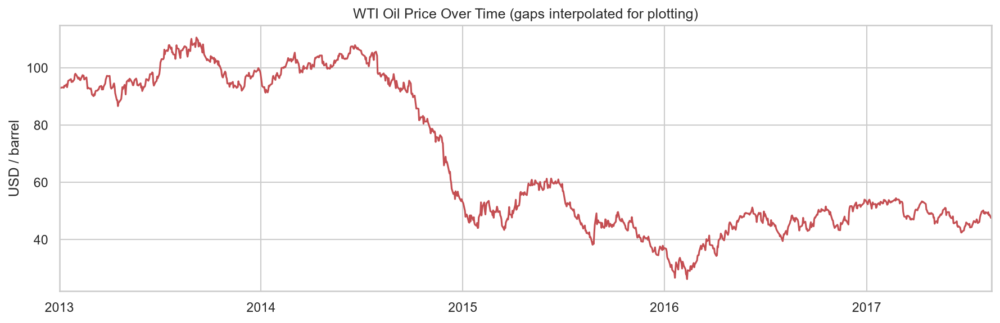
</p>

WTI oil price ranges from $26.19 to $110.62 over the window (mean $67.71), with a pronounced decline starting in 2014 — Ecuador's oil-dependent economy makes this a plausible national-level demand signal, tested directly in Experiment 6.

### 7.5 Promotions and Holidays

<p align="center">
  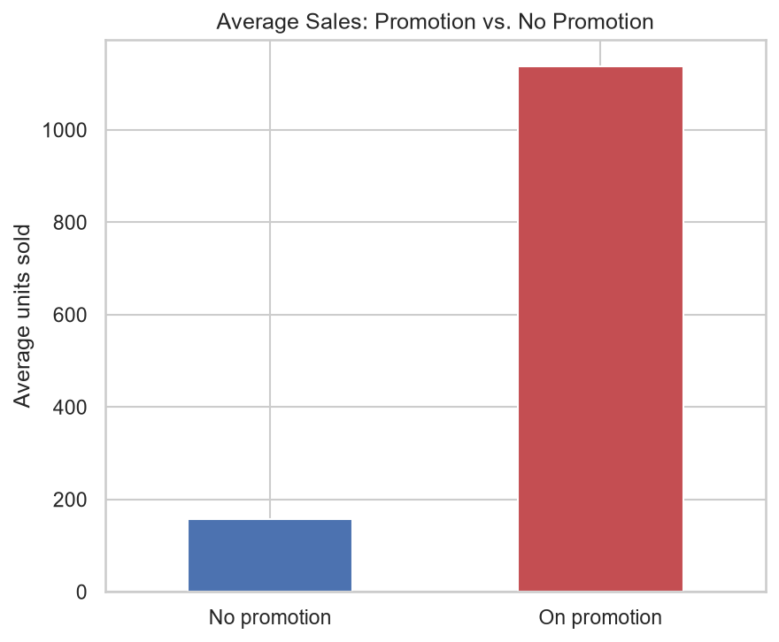
  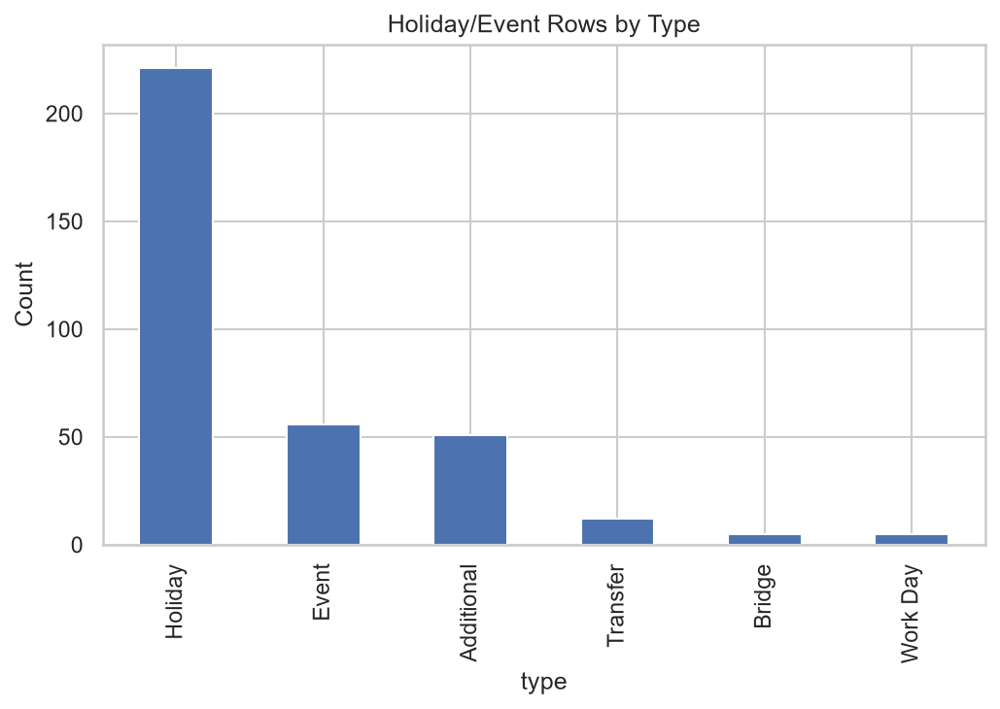
</p>

Average sales on promoted items are substantially higher than on non-promoted ones — confirming `onpromotion` as one of the strongest available signals, exactly as the project guidelines anticipate.

### 7.6 Seasonality

<p align="center">
  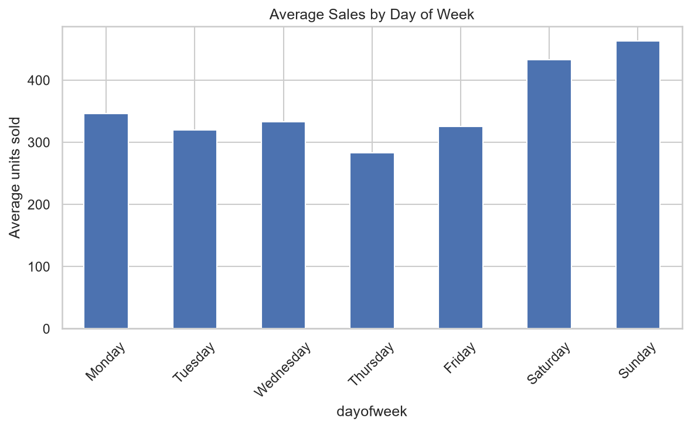
  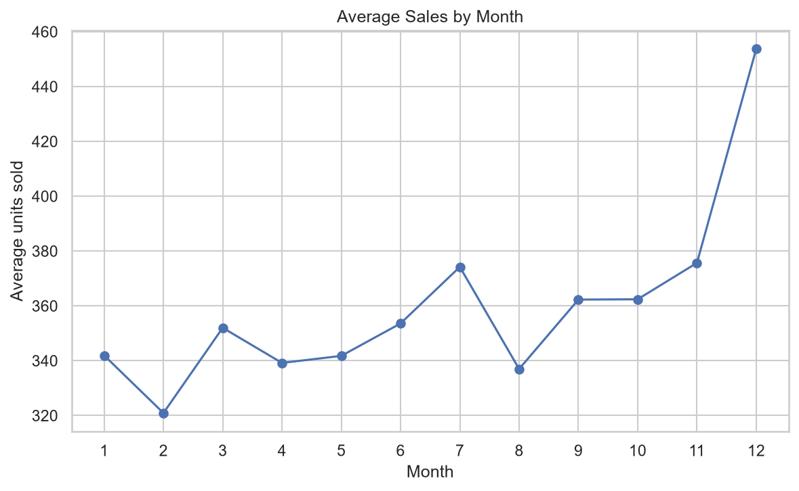
</p>

Sales rise sharply toward the weekend and show a clear December peak (holiday shopping) — both patterns motivated the `dayofweek`, `month`, and `is_weekend` calendar features (Section 8).

### 7.7 Geography

<p align="center">
  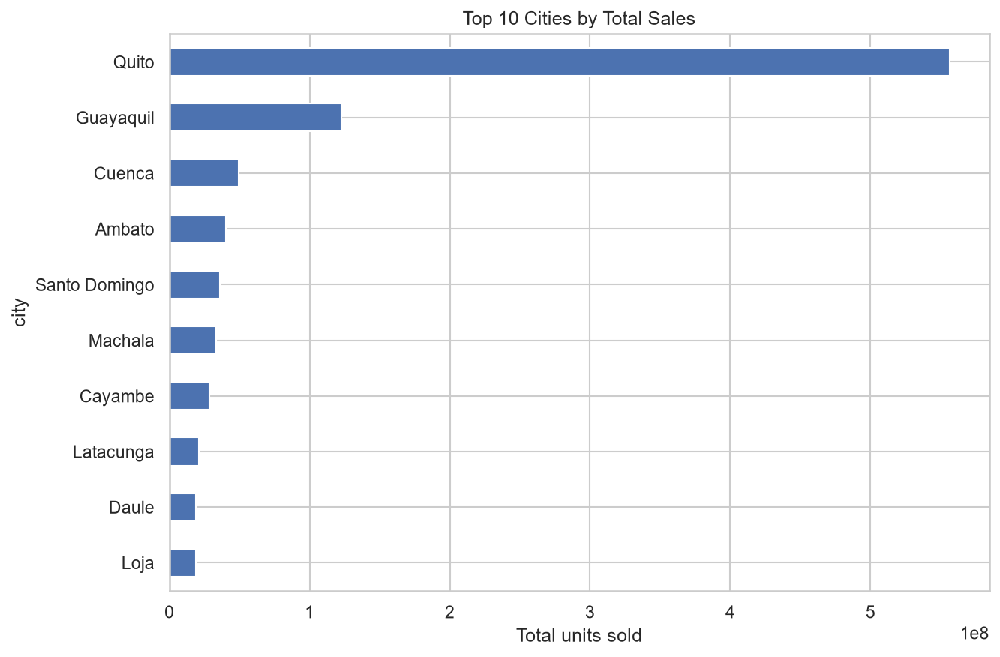
  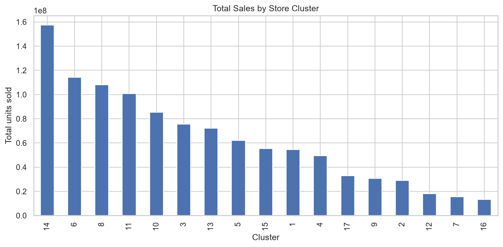
</p>

Quito and Guayaquil — the two largest cities — account for a disproportionate share of total sales, tracking the store-count concentration in Section 5.

### 7.8 A Quick Holiday-Effect Sanity Check

<p align="center">
  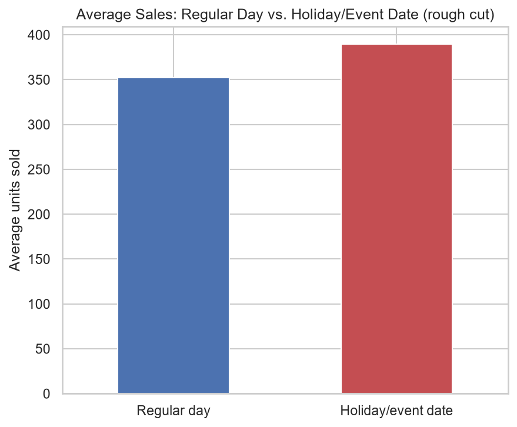
</p>

This is a descriptive cut only — it uses every date appearing anywhere in `holidays_events.csv`, not the leakage-safe transferred-flag resolution from Section 6.2. Treated as an EDA sanity check, not a modeling feature.

### 7.9 Transactions vs. Sales

<p align="center">
  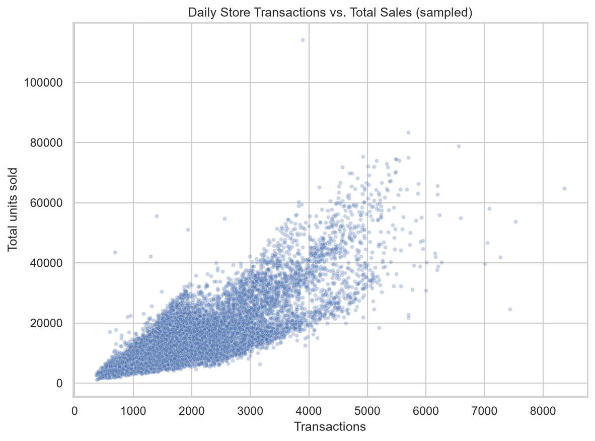
</p>

Daily transaction counts and daily sales are positively related but far from perfectly so, confirming `transactions` as a useful, non-redundant proxy feature rather than a duplicate of the target.

### 7.10 Correlation Snapshot — Before Feature Engineering

<p align="center">
  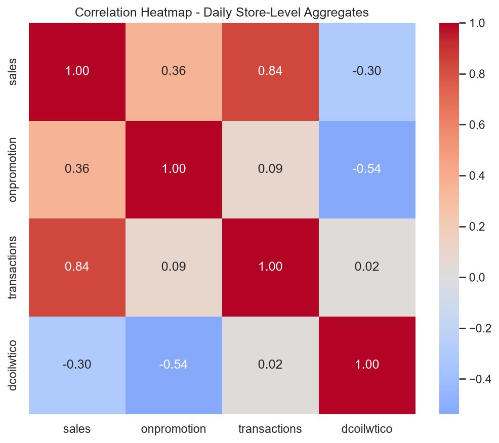
</p>

Raw daily aggregates (sales, promotions, transactions, oil price) show only modest pairwise linear correlation — consistent with a problem where lag/rolling history (Section 8), not any single instantaneous feature, carries most of the predictive signal.

### 7.11 EDA Summary Table

| Question Asked | Plot | Answer |
|---|---|---|
| Is there an overall trend? | Total sales over time | Yes — steady growth plus sharp promotion/holiday spikes |
| Is the target skewed? | Sales distribution histogram | Heavily right-skewed with many zero-sales days |
| Which families/types dominate? | Family & store-type bar charts | Grocery I, Beverages, Produce; Type D and C stores |
| Does oil price move with the economy? | Oil price line chart | Yes — a clear multi-year decline from 2014 |
| Do promotions lift sales? | Promotion effect bar chart | Yes — a clear, large lift |
| Is there weekly/monthly seasonality? | Day-of-week & monthly charts | Yes — weekend and December peaks |
| Does geography matter? | City & cluster bar charts | Yes — sales concentrate in Quito and Guayaquil |
| Do transactions track sales? | Scatter plot | Positively, but imperfectly — a useful non-redundant feature |
| Does anything correlate strongly on its own? | Correlation heatmap | No single raw feature dominates — motivates lag/rolling engineering |

---

## 8. Feature Engineering — the Process Phase

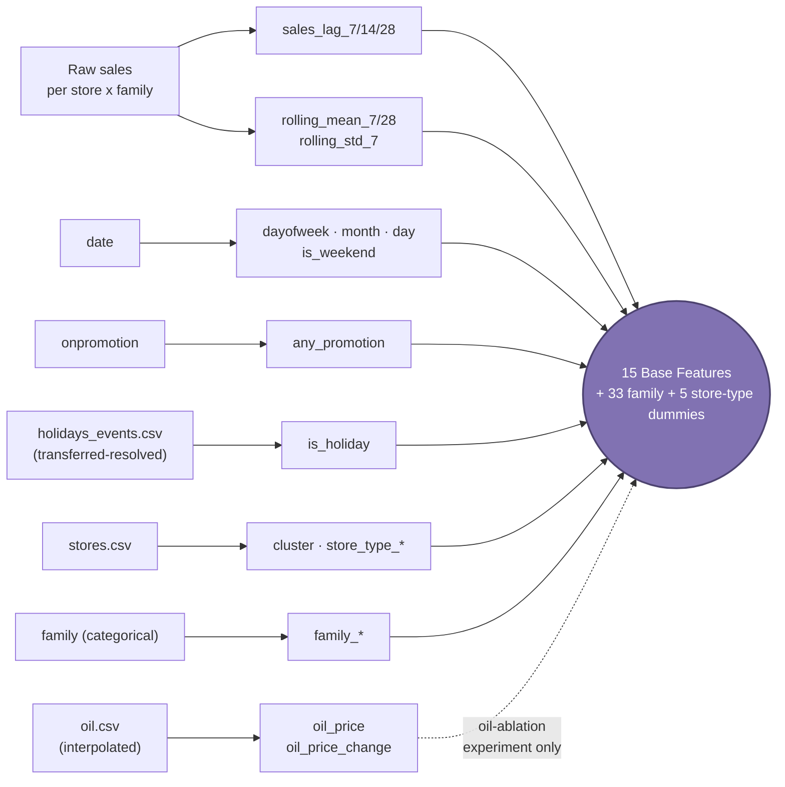
```mermaid
flowchart LR
    SALES["Raw sales<br/>per store x family"] --> LAG["sales_lag_7/14/28"]
    SALES --> ROLL["rolling_mean_7/28<br/>rolling_std_7"]
    DATE["date"] --> CAL["dayofweek · month · day<br/>is_weekend"]
    PROMO["onpromotion"] --> PFLAG["any_promotion"]
    HOL["holidays_events.csv<br/>(transferred-resolved)"] --> HFLAG["is_holiday"]
    OIL["oil.csv<br/>(interpolated)"] --> OILF["oil_price<br/>oil_price_change"]
    STORE["stores.csv"] --> SMETA["cluster · store_type_*"]
    FAM["family (categorical)"] --> FOHE["family_*"]

    LAG --> FEATURES(("15 Base Features<br/>+ 33 family + 5 store-type dummies"))
    ROLL --> FEATURES
    CAL --> FEATURES
    PFLAG --> FEATURES
    HFLAG --> FEATURES
    SMETA --> FEATURES
    FOHE --> FEATURES
    OILF -.->|"oil-ablation<br/>experiment only"| FEATURES

    style FEATURES fill:#8172B2,color:#fff,stroke:#4d4370,stroke-width:2px
```

### 8.1 Merging Everything onto the Sales Table

```python
data = train.merge(stores, on="store_nbr", how="left")

oil_filled = oil.set_index("date").reindex(full_date_range)["dcoilwtico"].interpolate().ffill().bfill()
oil_filled = oil_filled.rename("oil_price").reset_index().rename(columns={"index": "date"})
data = data.merge(oil_filled, on="date", how="left")

data["is_holiday"] = data["date"].isin(holiday_dates).astype("int8")

data = data.merge(transactions, on=["date", "store_nbr"], how="left")
data["transactions"] = data.groupby("store_nbr", observed=True)["transactions"].transform(
    lambda s: s.fillna(s.median())
)
```

Missing per-store transaction counts (from the left join) are filled with that **store's own median** — a store-specific fill, not a global one, so a small store's typical traffic isn't inflated toward a large store's.

### 8.2 Lag, Rolling, and Calendar Features

```python
data = data.sort_values(["store_nbr", "family", "date"])
grp = data.groupby(["store_nbr", "family"], observed=True)["sales"]

for lag in [7, 14, 28]:
    data[f"sales_lag_{lag}"] = grp.shift(lag)

# Rolling stats computed on already-shifted (lag-1) sales, so today's own value never leaks in.
shifted = grp.shift(1)
data["rolling_mean_7"] = shifted.groupby([data["store_nbr"], data["family"]]).transform(
    lambda s: s.rolling(7, min_periods=1).mean()
)
data["rolling_mean_28"] = shifted.groupby([data["store_nbr"], data["family"]]).transform(
    lambda s: s.rolling(28, min_periods=1).mean()
)
data["rolling_std_7"] = shifted.groupby([data["store_nbr"], data["family"]]).transform(
    lambda s: s.rolling(7, min_periods=1).std()
)

data["dayofweek"] = data["date"].dt.dayofweek
data["month"] = data["date"].dt.month
data["day"] = data["date"].dt.day
data["is_weekend"] = data["dayofweek"].isin([5, 6]).astype("int8")
data["any_promotion"] = (data["onpromotion"] > 0).astype("int8")
data["oil_price_change"] = data["oil_price"].diff().fillna(0)

before = len(data)
data = data.dropna(subset=["sales_lag_28"]).reset_index(drop=True)
# Dropped 261,690 warm-up rows; 2,739,198 rows remain.
```

Every lag/rolling feature is computed **within each `store_nbr` × `family` group** — grouping before shifting/rolling is what prevents one series' history from leaking into another's. Rolling statistics are computed on **already-shifted** (lag-1) sales, so a day's own sales value never leaks into its own rolling window. The warm-up rows at the start of each series, where `sales_lag_28` isn't yet available, are dropped rather than filled.

### 8.3 One-Hot Encoding

```python
data = pd.get_dummies(data, columns=["family", "type"], prefix=["family", "store_type"], dtype="int8")
```

`family` (33 categories) and the store's `type` (5 categories, A–E) are one-hot encoded, contributing 38 of the model's feature columns.

### 8.4 Final Feature Set

| # | Feature | Type | Captures |
|---|---|---|---|
| 1 | `onpromotion` | Numeric | Raw count of items on promotion that day |
| 2 | `any_promotion` | Binary | Whether the row has any promotion at all |
| 3 | `is_holiday` | Binary | Transferred-flag-resolved national holiday/non-working day |
| 4 | `cluster` | Numeric | Store grouping (1 of 17) |
| 5–7 | `sales_lag_7/14/28` | Numeric | Sales exactly 1/2/4 weeks ago, same series |
| 8–9 | `rolling_mean_7/28` | Numeric | Recent average sales level, same series |
| 10 | `rolling_std_7` | Numeric | Recent sales volatility, same series |
| 11 | `dayofweek` | Numeric | Day-of-week seasonality |
| 12 | `month` | Numeric | Month-of-year seasonality |
| 13 | `day` | Numeric | Day-of-month |
| 14 | `is_weekend` | Binary | Weekend flag |
| 15 | `transactions` | Numeric | Store-level daily traffic proxy |
| 16–48 | `family_*` | Binary (33 columns) | Product-family one-hot |
| 49–53 | `store_type_*` | Binary (5 columns) | Store-type one-hot |
| *(oil-ablation only)* | `oil_price`, `oil_price_change` | Numeric | Macroeconomic level and momentum — Experiment 6 only |

The base feature set (`feature_cols_base`, 15 + 33 + 5 = 53 columns) is what every experiment except Experiment 6 (`feature_cols_with_oil`, +2 columns) trains on.

---

## 9. Train / Validation / Test Methodology

```python
TEST_DAYS = 15
max_date = data["date"].max()
test_start = max_date - pd.Timedelta(days=TEST_DAYS - 1)
val_start = test_start - pd.Timedelta(days=TEST_DAYS)

train_df = data[data["date"] < val_start]
val_df = data[(data["date"] >= val_start) & (data["date"] < test_start)]
test_df = data[data["date"] >= test_start]
```

| Split | Date range | Rows |
|---|---|---|
| Train | 2013-01-29 to 2017-07-16 | 2,897,532 |
| Validation | 2017-07-17 to 2017-07-31 | 26,730 |
| Test | 2017-08-01 to 2017-08-15 | 26,730 |

The split is **strictly chronological** — training only ever contains dates before validation, which only contains dates before test. This is never a random shuffle: shuffling a time series before splitting would let future sales values leak into training via the lag/rolling features, silently inflating every reported metric. The 15-day test window exactly matches the business task's forecast horizon and the Kaggle competition's own `test.csv` window.

---

## 10. Incorporating Exogenous Signals — Promotions, Holidays & Oil

The project guideline to "use historical sales data, promotions, holidays, etc." is the specific technical challenge this project has to solve well — the equivalent slot to the fraud-detection project's class-imbalance section.

| Signal | Handling | Role |
|---|---|---|
| **Promotions** (`onpromotion`) | Used directly as a count, plus a binary `any_promotion` flag | One of the strongest available signals (Section 7.5); reflects *planned* future promotions, matching how `test.csv` is actually populated |
| **Holidays** (`holidays_events.csv`) | Transferred-flag correctly resolved (Section 6.2); National-level only, applied uniformly | A "free," reliable signal — holiday dates are known in advance for the whole forecast horizon |
| **Oil price** (`oil.csv`) | Interpolated across the 31.1% missing days, then forward/back-filled; level and day-over-day change both computed | Treated as a **secondary, ablation-only** feature (Experiment 6) given its expected weak signal at the individual store × family level |

Consistent with the project plan's own expectation, oil price turned out to be a genuinely weak signal at this granularity: adding it to XGBoost's feature set made WAPE *worse* (13.14% vs. 12.20% without it, Section 15) rather than better — a result that argues for keeping it out of the deployed model rather than for expanding its role.

---

## 11. Modeling Techniques — Classical, Global ML & Deep Learning

The project guideline names ARIMA, Prophet, or LSTM. All three are tried here, alongside a global tree-based track — the same "regression on date/lag features" approach every reference project video for this problem actually uses in practice — and a naive baseline every other model must beat.

### 11.1 Naive & Seasonal-Naive Baselines

```python
naive_forecast = series.shift(1)          # yesterday's value
seasonal_naive_forecast = series.shift(7)  # same weekday last week
```

Costs nothing to compute and is the essential minimum bar (Experiments 1a/1b).

### 11.2 ARIMA (SARIMAX)

```python
model = SARIMAX(
    train_part, order=(1, 1, 1), seasonal_order=(1, 1, 1, 7),
    enforce_stationarity=False, enforce_invertibility=False,
)
```

Plain ARIMA has no built-in seasonal term, so a `seasonal_order` with weekly periodicity (`s=7`) is added directly rather than manually de-seasonalizing first. Fit **one series at a time** — impractical across all 1,782 series in a first pass, so restricted to the 5 highest-volume representative series (Experiment 2).

### 11.3 Prophet

```python
model = Prophet(holidays=prophet_holidays_df, weekly_seasonality=True, yearly_seasonality=True)
model.add_regressor("onpromotion")
model.fit(train_part)
```

Prophet's built-in holiday-effects support takes the resolved holiday dates directly as regressors, and `onpromotion` is added as an additional regressor — also fit per representative series (Experiment 3).

### 11.4 Global Random Forest & XGBoost

```python
rf = RandomForestRegressor(n_estimators=300, max_depth=12, random_state=RANDOM_STATE, n_jobs=-1)
xgb_model = xgb.XGBRegressor(n_estimators=400, max_depth=8, learning_rate=0.05, random_state=RANDOM_STATE, n_jobs=-1)
```

Both are trained as **one model across all 1,782 series at once**, using `store_nbr`'s cluster/type and `family` as ordinary features rather than fitting a separate model per series — the practical way to cover the full dataset, and the pattern used by every reference project video (Experiments 4–6).

### 11.5 Global LSTM with Store/Family Embeddings

```python
store_emb = layers.Embedding(len(store_ids), 4)(store_input)
family_emb = layers.Embedding(len(family_ids), 4)(family_input)
lstm_out = layers.LSTM(32)(seq_input)
combined = layers.Concatenate()([lstm_out, store_emb, family_emb])
```

A single global LSTM learns a dense embedding per store and per family alongside a 28-day lookback sequence of past sales, letting one network specialize its predictions per series without training 1,782 separate models. Built from a **50-series sample** rather than all 1,782 to keep training time reasonable for a first pass — the same code scales to the full set by widening `N_SAMPLE_SERIES` (Experiment 7).

### 11.6 Why Both a Global and a Per-Series Track

Running ARIMA/Prophet across all 1,782 series individually is slow and hard to maintain, and doesn't scale well to a first pass; running a single classical model across all series isn't how ARIMA/Prophet work. Training both a **per-series classical track** (satisfying the named-technique guideline directly) and a **global machine-learning/deep-learning track** (the practical, scalable approach) lets the comparison be fair and empirical rather than picking one family of technique up front.

---

## 12. Hyperparameter Tuning

```python
param_dist = {
    "n_estimators": [200, 300, 400, 500],
    "max_depth": [6, 8, 10, 12],
    "learning_rate": [0.01, 0.05, 0.1, 0.2],
    "subsample": [0.7, 0.8, 0.9, 1.0],
    "colsample_bytree": [0.7, 0.8, 0.9, 1.0],
}

tscv = TimeSeriesSplit(n_splits=3)
search = RandomizedSearchCV(
    xgb.XGBRegressor(random_state=RANDOM_STATE, n_jobs=-1),
    param_distributions=param_dist, n_iter=15, scoring="neg_root_mean_squared_error",
    cv=tscv, random_state=RANDOM_STATE, n_jobs=-1, verbose=1,
)
```

`TimeSeriesSplit` gives **rolling-origin** folds — never a random k-fold shuffle — so each fold trains on an earlier block and validates on the block immediately after it, respecting the same never-shuffle rule as the train/val/test split itself.

**Best params found:** `subsample=1.0, n_estimators=500, max_depth=8, learning_rate=0.01, colsample_bytree=0.7`.

**Result:** the tuned model's WAPE (13.76%) is *worse* than the untuned XGBoost's (12.20%, Experiment 5). This is reported as a genuine finding rather than hidden: `RandomizedSearchCV` optimized for RMSE on rolling-origin CV folds during the search, which doesn't necessarily track WAPE on this specific 15-day holdout — a reminder, echoed from the fraud-detection project's own final-selection logic, that a tuned model isn't automatically the better choice (Section 16).

---

## 13. Evaluation Metrics Explained

| Metric | Definition | Why It Matters Here | Caveat |
|---|---|---|---|
| **RMSE** | √(mean squared error) | Named in the guidelines; the standard headline metric, penalizes large promotion-day spikes heavily | Not comparable across product families with very different volumes without normalizing per series |
| **MAPE** | mean(\|error\| / \|actual\|) × 100 | Named in the guidelines; intuitive, scale-free percentage | **Structurally unreliable here**: undefined/explodes when actual sales are 0, which is common for slow-moving product families — reported for every experiment but never used to pick the winner |
| **WAPE** ⭐ | Σ\|error\| / Σ\|actual\| × 100 | Fixes MAPE's zero-division problem and aggregates cleanly across all 1,782 series into one interpretable percentage — the **primary metric used for model selection** | Still a ratio metric; can behave oddly on very low-volume series unless aggregated sensibly |
| **Forecast Bias** | (Σpredicted − Σactual) / Σactual × 100 | Directly answers "are we systematically over- or under-stocking?" — the business-facing tie-breaker given the inventory-optimization goal | A single aggregate number can hide series-level errors that cancel out overall |

MAPE is deliberately **not** the deciding metric: on this dataset's many zero-sales days, a model can score an artificially poor (or, in degenerate cases, artificially good) MAPE without that reflecting genuine forecast quality — exactly the critique behind the project's WAPE-first evaluation approach.

---

## 14. The Machine Learning Workflow, End to End

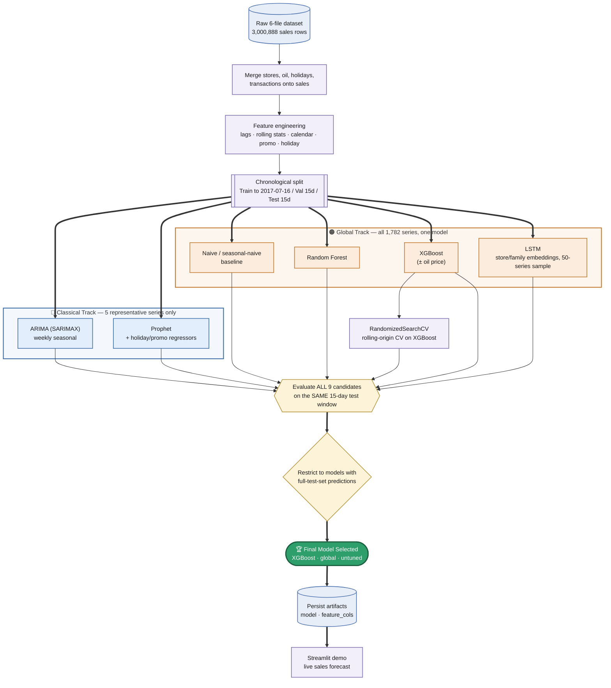
```mermaid
%%{init: {"flowchart": {"curve": "basis"}, "themeVariables": {"fontSize": "14px"}}}%%
flowchart TD
    R[("Raw 6-file dataset<br/>3,000,888 sales rows")]
    S["Merge stores, oil, holidays,<br/>transactions onto sales"]
    FE["Feature engineering<br/>lags · rolling stats · calendar · promo · holiday"]
    SPLIT[["Chronological split<br/>Train to 2017-07-16 / Val 15d / Test 15d"]]

    R --> S --> FE --> SPLIT

    subgraph CLASSICAL["🔵 Classical Track — 5 representative series only"]
        U1["ARIMA (SARIMAX)<br/>weekly seasonal"]
        U2["Prophet<br/>+ holiday/promo regressors"]
    end

    subgraph GLOBAL["🟠 Global Track — all 1,782 series, one model"]
        V1["Naive / seasonal-naive<br/>baseline"]
        V2["Random Forest"]
        V3["XGBoost<br/>(± oil price)"]
        V4["LSTM<br/>store/family embeddings, 50-series sample"]
    end

    SPLIT ==> U1
    SPLIT ==> U2
    SPLIT ==> V1
    SPLIT ==> V2
    SPLIT ==> V3
    SPLIT ==> V4

    TUNE["RandomizedSearchCV<br/>rolling-origin CV on XGBoost"]
    V3 --> TUNE

    EVAL{{"Evaluate ALL 9 candidates<br/>on the SAME 15-day test window"}}
    U1 --> EVAL
    U2 --> EVAL
    V1 --> EVAL
    V2 --> EVAL
    V3 --> EVAL
    V4 --> EVAL
    TUNE --> EVAL

    DEPLOY{"Restrict to models with<br/>full-test-set predictions"}
    FINAL(["🏆 Final Model Selected<br/>XGBoost · global · untuned"])
    ART[("Persist artifacts<br/>model · feature_cols")]
    DEMO["Streamlit demo<br/>live sales forecast"]

    EVAL ==> DEPLOY ==> FINAL ==> ART ==> DEMO

    classDef data     fill:#e8eef7,stroke:#4C72B0,stroke-width:1.5px,color:#1a1a1a
    classDef decision fill:#fdf3d8,stroke:#b8973f,stroke-width:1.5px,color:#1a1a1a
    classDef process  fill:#f2eefa,stroke:#8172B2,stroke-width:1.5px,color:#1a1a1a
    classDef classical fill:#e3eefc,stroke:#3d6ea8,stroke-width:1.5px,color:#1a1a1a
    classDef global   fill:#fcecdd,stroke:#c47a2f,stroke-width:1.5px,color:#1a1a1a
    classDef final    fill:#2e9e6b,stroke:#1d5f41,stroke-width:2.5px,color:#ffffff

    class R,ART data
    class DEPLOY,EVAL decision
    class S,FE,SPLIT,TUNE,DEMO process
    class U1,U2 classical
    class V1,V2,V3,V4 global
    class FINAL final

    style CLASSICAL fill:#f4f8fd,stroke:#3d6ea8,stroke-width:2px
    style GLOBAL    fill:#fdf6ee,stroke:#c47a2f,stroke-width:2px
```

**Key design choices baked into this workflow:**
- The 15-day test window is split off chronologically **before** any modeling, so every reported metric reflects a genuine forward forecast, not information leaked from the future.
- Both a per-series classical track and a global ML/deep-learning track are trained, satisfying the guideline's "ARIMA, Prophet, or LSTM" naming by covering all three, plus the practical tree-based approach every reference project actually uses.
- The final model is chosen only from candidates with **full-test-set predictions to actually deploy** — not by assuming whichever scored best on the smaller representative-series comparison automatically wins if it can't be deployed at scale.

---

## 15. Results — the Full Experiment Matrix

### 15.1 Representative-Series Comparison (all 9 experiments, same 5 series)

| Experiment | RMSE | MAPE (%) | WAPE (%) | Bias (%) |
|---|---|---|---|---|
| **5. XGBoost (global, lags+calendar+promo+holiday)** ⭐ | 189.65 | 42.43 | **12.20** | +2.22 |
| 6. XGBoost + oil price | 202.29 | 41.53 | 13.14 | +3.78 |
| 8. XGBoost (tuned, global) | 206.37 | 62.04 | 13.76 | +4.10 |
| 4. Random Forest (global, lags+calendar+promo+holiday) | 229.12 | 42.91 | 14.83 | +4.08 |
| 1a. Naive (yesterday's value) | 2,063.52 | 16.22 | 15.77 | +1.93 |
| 3. Prophet (holiday + promotion regressors) | 2,031.17 | 17.07 | 16.49 | +9.56 |
| 1b. Seasonal-naive (same weekday last week) | 2,503.25 | 21.75 | 21.14 | +8.66 |
| 2. ARIMA (SARIMAX, weekly seasonal) | 3,227.97 | 27.82 | 25.92 | +12.26 |
| 7. LSTM (global, store/family embeddings, 50-series sample) | 500.63 | 74.75 | 27.01 | −10.61 |

### 15.2 Global Aggregate Performance (full test set, deployable models only)

| Model | RMSE | WAPE (%) | Bias (%) |
|---|---|---|---|
| **XGBoost (global, no oil)** ⭐ | 189.65 | 12.20 | +2.22 |
| XGBoost (global, + oil) | 202.29 | 13.14 | +3.78 |
| XGBoost (tuned, global) | 206.37 | 13.76 | +4.10 |
| Random Forest (global, no oil) | 229.12 | 14.83 | +4.08 |

<p align="center">
  
</p>

Every RMSE/WAPE value on the full test set (Table 15.2) matches the representative-series comparison (Table 15.1) exactly for the four global models — because the global models' predictions cover the entire test set regardless of which slice is used to score them, unlike the per-series-fit ARIMA/Prophet/LSTM experiments, which only ever produce predictions for their own sampled series.

---

## 16. Final Model Selection

Only Experiments 4, 5, 6, and 8 (Random Forest / XGBoost variants) were trained as a **single global model with predictions across the entire test set** — Experiments 1a/1b (naive baselines), 2 (ARIMA), 3 (Prophet), and 7 (LSTM) were only evaluated on a handful of representative series (Section 11), so there is no full-test-set model behind them to deploy or save. The final model is therefore selected as the **best-by-WAPE experiment among the deployable global models**, not hardcoded to whichever one happened to get tuned last:

```python
global_candidates = {
    "4. Random Forest (global, lags+calendar+promo+holiday)": (rf, rf_pred_full),
    "5. XGBoost (global, lags+calendar+promo+holiday)": (xgb_model, xgb_pred_full),
    "6. XGBoost + oil price": (xgb_oil_model, xgb_oil_pred_full),
    "8. XGBoost (tuned, global)": (best_model, best_pred_full),
}
deployable_ranked = final_results_df[final_results_df["Experiment"].isin(global_candidates)]
best_row = deployable_ranked.iloc[0]
final_model_name = best_row["Experiment"]
```

**Selected: `5. XGBoost (global, lags+calendar+promo+holiday)`** — untuned, `n_estimators=400, max_depth=8, learning_rate=0.05` — WAPE 12.20%, RMSE 189.65.

This experiment also tops the full representative-series comparison (Table 15.1) — no complexity-vs-deployability tradeoff was needed here, unlike a scenario where the overall best-scoring experiment might have no deployable global model behind it.

**A genuine, reported finding:** hyperparameter tuning did **not** improve on the untuned model — tuned WAPE (13.76%) is worse than untuned WAPE (12.20%). Likely cause: `RandomizedSearchCV` optimized for RMSE on rolling-origin CV folds (Section 12), which doesn't necessarily track WAPE on this specific 15-day holdout. Both the model-selection logic and this write-up report this plainly rather than assuming "tuned" automatically means "best" — the same discipline the fraud-detection project applied when comparing Random Forest and XGBoost at their own optimal thresholds.

```python
joblib.dump(final_model, "models/final_model.joblib")
joblib.dump(feature_cols_base, "models/feature_cols.joblib")
```

---

## 17. Explainability — Feature Importance

<p align="center">
  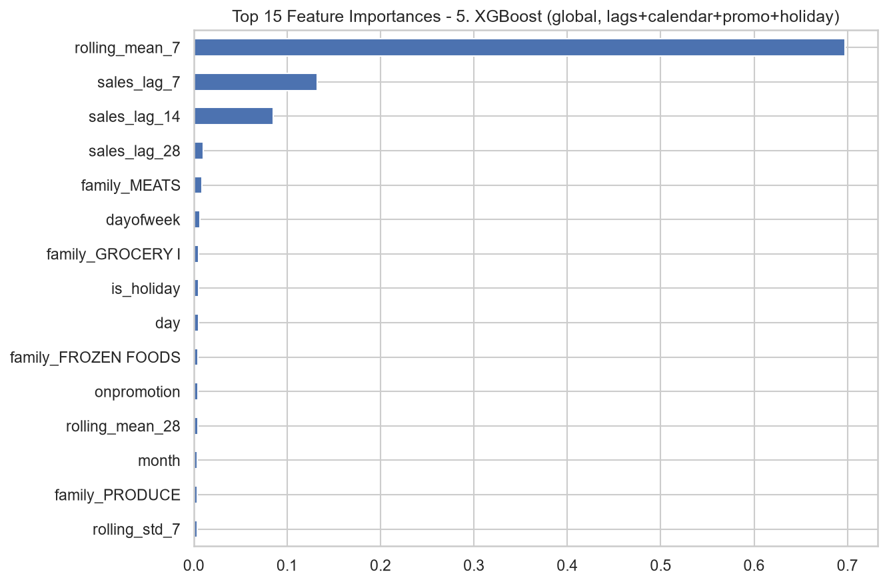
</p>

The final XGBoost model's built-in `.feature_importances_` are plotted as a horizontal bar chart of the top 15 features. Recent sales history (`sales_lag_7`, `rolling_mean_7`, `rolling_mean_28`) and the `family_*` one-hot columns dominate, consistent with Section 7's finding that no single raw exogenous signal correlates strongly with sales on its own — the model's predictive power comes from combining recent-history features with product-family identity, not from any one instantaneous input.

Unlike the fraud-detection project (which used SHAP for a per-prediction beeswarm plot), this project uses the tree model's native feature importances directly — a lighter-weight but still stakeholder-legible way to answer "what is this forecast actually based on?"

---

## 18. Notebook Structure & Code Walkthrough

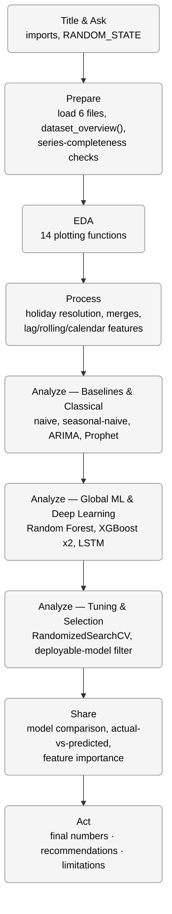
```mermaid
flowchart TD
    N0["Title & Ask<br/>imports, RANDOM_STATE"] --> N1["Prepare<br/>load 6 files, dataset_overview(),<br/>series-completeness checks"]
    N1 --> N2["EDA<br/>14 plotting functions"]
    N2 --> N3["Process<br/>holiday resolution, merges,<br/>lag/rolling/calendar features"]
    N3 --> N4["Analyze — Baselines & Classical<br/>naive, seasonal-naive, ARIMA, Prophet"]
    N4 --> N5["Analyze — Global ML & Deep Learning<br/>Random Forest, XGBoost x2, LSTM"]
    N5 --> N6["Analyze — Tuning & Selection<br/>RandomizedSearchCV, deployable-model filter"]
    N6 --> N7["Share<br/>model comparison, actual-vs-predicted,<br/>feature importance"]
    N7 --> N8["Act<br/>final numbers · recommendations · limitations"]

    classDef sec fill:#f5f5f5,stroke:#888,stroke-width:1px,rx:6,ry:6, color:#000000
    class N0,N1,N2,N3,N4,N5,N6,N7,N8 sec
```

| Notebook Section | Cell Range | Key Functions / Objects Defined |
|---|---|---|
| Title & Ask | 0–1 | Markdown framing, business task |
| Prepare | 2–20 | Imports, `RANDOM_STATE`, `dataset_overview()`, `store_network_summary()`, `numeric_summary()`, `categorical_summary()`, series/oil/holiday completeness checks |
| EDA | 21–42 | `plot_total_sales_over_time()`, `plot_sales_distribution()`, `plot_sales_by_family()`, `plot_sales_by_store_type()`, `plot_oil_price()`, `plot_promotion_effect()`, `plot_holiday_counts()`, `plot_dayofweek_seasonality()`, `plot_monthly_seasonality()`, `plot_sales_by_city()`, `plot_sales_by_cluster()`, `plot_holiday_effect()`, `plot_transactions_vs_sales()`, `plot_raw_correlation_heatmap()`, `plot_missing_days_distribution()` |
| Process | 43–50 | `build_holiday_flag()`, merges, lag/rolling/calendar feature engineering, one-hot encoding, chronological split |
| Analyze | 51–77 | `evaluate_forecast()`, `evaluate_global()`, all 9 experiments, `RandomizedSearchCV`, deployable-model final selection, `joblib.dump()` |
| Share | 78–81 | `plot_model_comparison()`, `plot_actual_vs_predicted()`, `plot_feature_importance()` |
| Act | 82–84 | Final metrics printout, recommendations, limitations |

Every one of the 18 plotting cells writes its figure straight to `assets/` (via `plt.savefig`) **before** displaying it inline, so re-running the notebook keeps the images backing this report and the README automatically in sync — no manual export step required.

---

## 19. Interactive Demo — the Streamlit App

`streamlit_app.py` is the project's optional deployment piece: a single-page app that loads the persisted model artifacts and forecasts one store × family × date combination live.

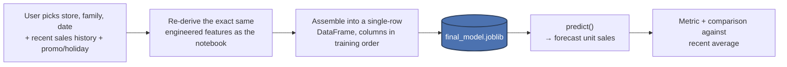
```mermaid
flowchart LR
    UI["User picks store, family, date<br/>+ recent sales history + promo/holiday"] --> RECOMP["Re-derive the exact same<br/>engineered features as the notebook"]
    RECOMP --> ORDER["Assemble into a single-row<br/>DataFrame, columns in training order"]
    ORDER --> MODEL[("final_model.joblib")]
    MODEL --> SCORE["predict()<br/>→ forecast unit sales"]
    SCORE --> DISPLAY["Metric + comparison against<br/>recent average"]

    style MODEL fill:#4C72B0,color:#fff,stroke:#2c3e5c,stroke-width:2px
```

```python
row = {
    "onpromotion": onpromotion,
    "any_promotion": int(onpromotion > 0),
    "is_holiday": int(is_holiday),
    "cluster": cluster,                       # entered directly on the form
    "sales_lag_7": sales_lag_7,
    "sales_lag_14": sales_lag_14,
    "sales_lag_28": sales_lag_28,
    "rolling_mean_7": rolling_mean_7,
    "rolling_mean_28": rolling_mean_28,
    "rolling_std_7": rolling_std_7,
    "dayofweek": forecast_date.weekday(),
    "month": forecast_date.month,
    "day": forecast_date.day,
    "is_weekend": int(forecast_date.weekday() >= 5),
    "transactions": transactions,
    f"family_{family}": 1,
    f"store_type_{store_type}": 1,
}
input_df = pd.DataFrame([{col: row.get(col, 0) for col in feature_cols}])
forecast = model.predict(input_df)[0]
```

Two implementation details worth calling out:

1. **Feature re-derivation, not re-use.** The app can't import the notebook's per-series groupby feature-engineering code directly (there's no live database of every series' recent history to query), so it re-implements the same formulas by hand, asking the user directly for the handful of numbers those features are computed from: sales 7/14/28 days ago, and the 7-/28-day rolling mean and 7-day rolling standard deviation of recent sales. This is a deliberate simplification, not a silent gap — the same tradeoff the fraud-detection project's demo made by defaulting velocity features to zero.
2. **Store metadata (`cluster`, `type`) is entered directly on the form** rather than looked up from `data/stores.csv` by `store_nbr`. `stores.csv` lives under the gitignored `data/` directory (Repository Structure), so a copy of it isn't guaranteed to exist wherever the app is deployed (e.g., Streamlit Community Cloud pulling straight from GitHub); asking for cluster/type directly keeps the demo self-contained, needing only the two files under `models/`.

`@st.cache_resource` ensures the model and feature list are loaded from disk once per session, and a `try/except FileNotFoundError` around the load gives a clear, actionable error message (pointing back at the notebook) if the app is launched before the model artifacts exist.

---

## 20. Visualization Reference

All 18 figures live in `assets/` and are generated directly by the notebook.

| # | File | Plot Type | What It Shows |
|---|---|---|---|
| 01 | `01_total_sales_over_time.png` | Line chart | Total daily unit sales across all stores and families, 2013–2017 |
| 02 | `02_sales_distribution.png` | Histogram (log-scaled x-axis) | Distribution of nonzero daily sales |
| 03 | `03_sales_by_family.png` | Horizontal bar chart | Total sales by product family, top 15 |
| 04 | `04_sales_by_store_type.png` | Bar chart | Total sales by store type (A–E) |
| 05 | `05_oil_price_over_time.png` | Line chart | WTI oil price over time (gaps interpolated for plotting) |
| 06 | `06_promotion_effect.png` | Bar chart | Average sales, on promotion vs. not |
| 07 | `07_holiday_counts.png` | Bar chart | Holiday/event rows by type |
| 08 | `08_dayofweek_seasonality.png` | Line/bar chart | Average sales by day of week |
| 09 | `09_monthly_seasonality.png` | Line chart | Average sales by month |
| 10 | `10_sales_by_city.png` | Horizontal bar chart | Total sales by city, top 10 |
| 11 | `11_sales_by_cluster.png` | Bar chart | Total sales by store cluster |
| 12 | `12_holiday_effect.png` | Bar chart | Average sales, holiday/event date vs. regular day |
| 13 | `13_transactions_vs_sales_scatter.png` | Scatter plot (sampled) | Daily transactions vs. daily sales, per store |
| 14 | `14_raw_correlation_heatmap.png` | Heatmap | Correlation among raw daily aggregates, before feature engineering |
| 15 | `15_missing_days_distribution.png` | Histogram | Distribution of missing calendar days per store × family series |
| 16 | `16_model_comparison_bar.png` | Horizontal bar chart | WAPE across all experiments on the representative-series comparison |
| 17 | `17_actual_vs_predicted.png` | Line chart | Actual vs. predicted sales for a representative series over the test window |
| 18 | `18_feature_importance.png` | Horizontal bar chart | Top 15 features by importance for the final XGBoost model |

**Why these plot types:** line charts for anything sequential (total sales, oil price, monthly seasonality, actual-vs-predicted), bar/horizontal-bar charts for categorical comparisons (family, city, cluster, store type, model comparison), histograms for distributional questions (sales, missing days), a scatter plot for the two-variable transactions/sales relationship, a heatmap for many-variable correlation at a glance, and the feature-importance bar chart as the most stakeholder-friendly way to explain *what* drives the final model's forecasts.

---

## 21. Recommendations

- Deploy the winning global XGBoost model across all ~1,782 series — it's the only track here actually trained and validated at that full scale, versus ARIMA/Prophet/LSTM, which were only validated on a sample.
- Use forecast bias **per product family**, not just the aggregate point forecast, to set safety-stock adjustments — a model that's unbiased in aggregate (+2.22% here) can still be badly biased for specific slow-moving families.
- Report WAPE alongside RMSE for any external-facing summary; drop MAPE as a decision metric — it breaks down on the many zero-sales days in this dataset.
- Do not assume tuning automatically helps — hyperparameter tuning made this model *worse* by WAPE; always compare a tuned candidate against its untuned baseline before deploying it, exactly as the deployable-model selection logic here does.
- Treat oil price as an ablation experiment, not a production feature — it measurably hurt WAPE here at the store × family granularity.

## 22. Limitations

- **Sales here are realized sales, not true demand** — stockouts can under-report demand on some days, so a model trained on this data may still be blind to how much was actually wanted, not just sold.
- **Every one of the ~1,782 series has at least one missing calendar day** out of the expected range — gaps were left as-is (no forward-fill/interpolation of missing sales rows) rather than assumed to be zero-sales days, since a missing row and a confirmed zero-sales day are not the same thing and conflating them would bias the lag/rolling features.
- **Hyperparameter tuning (Experiment 8) did not outperform the untuned XGBoost (Experiment 5)** on this holdout — a reminder that a tuned model isn't automatically the better choice, and that the final-model selection logic in Analyze picks by actual WAPE rather than assuming the more-tuned model wins.
- **ARIMA, Prophet, and the LSTM were only fit/validated on a sample of series** (5 for the classical models, 50 for the LSTM) rather than the full ~1,782 — a fair comparison at full scale would need to run all of them across every series, out of scope for a first pass given per-series fitting time.
- **Only National-level holidays were applied uniformly** to every store; Regional/Local holidays (which need matching each store's city/state) were left out of the holiday flag.
- **MAPE is unreliable on the many zero-sales days here** — WAPE and bias are reported alongside it for exactly that reason.
- **The dataset ends in 2017** and reflects Ecuador-specific holidays and an oil-dependent economy; conclusions about which features matter most may not transfer to a different country or retailer without re-validation.
- **The Streamlit demo asks the user to enter lag/rolling sales figures directly** rather than looking them up from a live per-series history store, since no such store exists outside the training notebook — a known, documented simplification (Section 19) rather than a silent gap.
